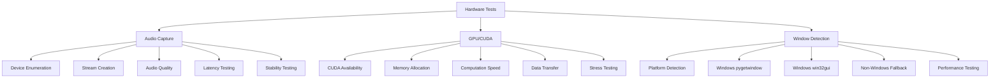
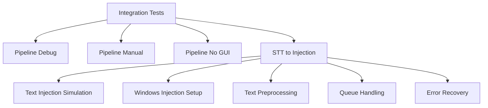
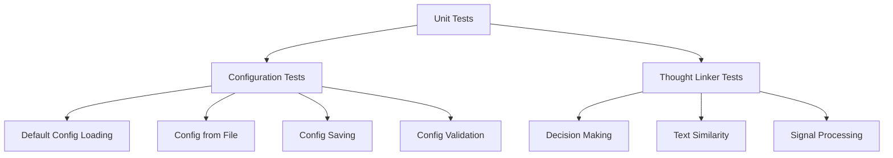
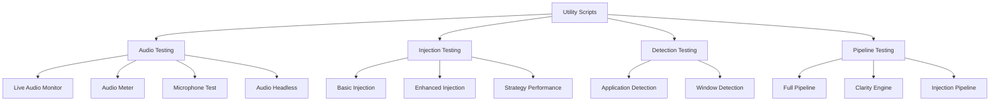
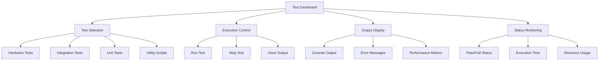

# PersonalParakeet Test Structure & Coverage Visualization

## Overview

This document provides a comprehensive visualization of the PersonalParakeet testing framework, including test structure, coverage analysis, and interactive dashboards.

## Test Structure Overview

```
PersonalParakeet Test Framework
├── Main Test Suite (/tests/)
│   ├── Unit Tests
│   ├── Hardware Tests  
│   ├── Integration Tests
│   ├── Interactive Tests
│   └── Benchmark Tests
└── Application Tests (/src/personalparakeet/tests/)
    ├── Mock-based Tests (CI/CD)
    └── Utility Scripts (Development)
```

## Detailed Test Structure

### 1. Main Test Suite (`/tests/`)

#### Core Infrastructure (`/tests/core/`)
- **`BaseHardwareTest`** - Abstract base class for all hardware tests
- **`HardwareValidator`** - Validates hardware availability and capabilities
- **`ResourceMonitor`** - Monitors system resources during test execution
- **`TestReporter`** - Collects and reports test results

#### Hardware Tests (`/tests/hardware/`)


#### Integration Tests (`/tests/integration/`)


#### Unit Tests (`/tests/unit/`)


### 2. Application Tests (`/src/personalparakeet/tests/`)

#### Utility Scripts (`/src/personalparakeet/tests/utilities/`)


## Test Categories & Markers

### Pytest Markers
```mermaid
graph LR
    A[Test Markers] --> B[@pytest.mark.hardware]
    A --> C[@pytest.mark.integration]
    A --> D[@pytest.mark.unit]
    A --> E[@pytest.mark.interactive]
    A --> F[@pytest.mark.benchmark]
    A --> G[@pytest.mark.slow]
    A --> H[@pytest.mark.gpu_intensive]
    A --> I[@pytest.mark.v2]
    A --> J[@pytest.mark.v3]
```

### Test Distribution by Category
| Category | Count | Location | Purpose |
|----------|-------|----------|---------|
| Hardware | 15+ | `/tests/hardware/` | Real hardware validation |
| Integration | 8+ | `/tests/integration/` | Multi-component workflows |
| Unit | 12+ | `/tests/unit/` | Isolated component testing |
| Interactive | 5+ | `/src/personalparakeet/tests/utilities/` | Manual development tools |
| Benchmark | 0+ | `/tests/benchmarks/` | Performance measurement |

## Test Coverage Analysis

### Coverage Data Status
- **Coverage File**: `.coverage` (exists)
- **HTML Report**: `htmlcov/` (needs generation)
- **Coverage Tool**: pytest-cov (configured in pyproject.toml)

### Source Code Coverage Targets

```mermaid
graph TD
    A[Source Code] --> B[Core Modules]
    A --> C[Audio Engine]
    A --> D[STT Processor]
    A --> E[Injection System]
    A --> F[UI Components]
    A --> G[Configuration]
    
    B --> B1[Application Detector]
    B --> B2[Clarity Engine]
    B --> B3[Command Processor]
    B --> B4[Thought Linker]
    
    C --> C1[Audio Resampler]
    C --> C2[VAD Engine]
    C --> C3[Audio Capture]
    
    D --> D1[STT Factory]
    D --> D2[STT Processor]
    D --> D3[Mock STT]
    
    E --> E1[Text Injector]
    E --> E2[Injection Manager]
    E --> E3[Enhanced Strategies]
    
    F --> F1[Dictation View]
    F --> F2[Window Detector]
    
    G --> G1[Config Management]
    G --> G2[Environment Setup]
```


## Test Execution Workflows

### 1. Quick Development Tests
```bash
# Run quick tests only
python3 tests/run_tests.py --quick --verbose

# Run unit tests only
pytest tests/ -m unit -v

# Run specific utility script
python3 src/personalparakeet/tests/utilities/test_live_audio.py
```

### 2. Full Hardware Validation
```bash
# Run all hardware tests
python3 tests/run_tests.py --hardware --verbose

# Run integration tests
python3 tests/run_tests.py --integration --verbose

# Run with GPU tests
python3 tests/run_tests.py --hardware --no-gpu=false --verbose
```

### 3. CI/CD Pipeline Tests
```bash
# Run non-hardware tests for CI
pytest tests/ -m "not hardware and not gpu_intensive" -v

# Run unit tests only
pytest tests/ -m unit -v

# Generate coverage report
pytest --cov=src/personalparakeet --cov-report=html:htmlcov
```

## Interactive Test Dashboard

### Test Dashboard Features
The project includes an interactive test dashboard (`tests/test_dashboard.py`) with:

- **Real-time test execution**
- **Visual test status indicators**
- **Test output display**
- **Test selection interface**
- **Performance monitoring**

### Dashboard Usage
```bash
# Launch interactive test dashboard
python3 tests/test_dashboard.py
```

### Dashboard Interface


## Test Configuration

### Pytest Configuration (`pytest.ini`)
- Test discovery patterns
- Test directories
- Coverage requirements
- Test markers
- Timeout settings
- Asyncio configuration

### Test Profiles (`tests/config.yaml`)
```yaml
profiles:
  high_end:
    gpu_memory: ">8GB"
    expected_latency: "<100ms"
  standard:
    gpu_memory: "4-8GB"
    expected_latency: "<200ms"
  minimal:
    gpu_memory: "<4GB"
    expected_latency: "<500ms"
```

## Test Reports & Output

### Report Generation
```bash
# Generate HTML report
pytest tests/ --html=test_reports/report.html --self-contained-html

# Generate coverage report
pytest --cov=src/personalparakeet --cov-report=html:htmlcov

# Generate JSON report
python3 tests/run_tests.py --report --verbose
```

### Report Locations
- **HTML Reports**: `test_reports/report.html`
- **Coverage Reports**: `htmlcov/index.html`
- **JSON Reports**: `test_reports/test_report_YYYYMMDD_HHMMSS.json`
- **Text Reports**: `test_reports/test_report_YYYYMMDD_HHMMSS.txt`

## Test Dependencies & Requirements

### Hardware Requirements
- **Minimum**: Microphone, 2GB+ GPU memory, Python 3.8+
- **Recommended**: USB microphone, NVIDIA GPU with 4GB+ memory, CUDA 11.0+
- **Optional**: Multiple audio devices, high-end GPU for stress testing

### Software Dependencies
- **Testing Framework**: pytest, pytest-asyncio, pytest-cov
- **Audio Processing**: sounddevice, soundfile, pyaudio
- **GPU Support**: torch, CUDA toolkit
- **System Integration**: pynput, pyperclip, keyboard
- **UI Framework**: Rust+EGUI (via PyO3 bridge)

## Test Development Guidelines

### Writing New Tests
1. **Use appropriate markers** (@pytest.mark.hardware, @pytest.mark.integration, etc.)
2. **Inherit from BaseHardwareTest** for hardware tests
3. **Include resource cleanup** in teardown methods
4. **Document hardware requirements** in test docstrings
5. **Provide fallbacks** for missing hardware

### Test Organization
- **Unit tests**: `/tests/unit/` - Isolated component testing
- **Hardware tests**: `/tests/hardware/` - Real hardware validation
- **Integration tests**: `/tests/integration/` - Multi-component workflows
- **Utility scripts**: `/src/personalparakeet/tests/utilities/` - Development tools

## Troubleshooting

### Common Issues
1. **No audio devices found**: Check audio drivers and permissions
2. **GPU not detected**: Verify CUDA installation and GPU drivers
3. **Tests running slowly**: Use `--quick` flag to exclude slow tests
4. **Import errors**: Ensure poetry dependencies are installed

### Debug Commands
```bash
# Check audio devices
python3 -c "import pyaudio; p=pyaudio.PyAudio(); print(p.get_device_count())"

# Check CUDA availability
python3 -c "import torch; print(torch.cuda.is_available())"

# Check test discovery
python3 -m pytest --collect-only tests/
```

## Future Enhancements

### Planned Improvements
1. **Enhanced Coverage Reports**: Interactive coverage visualization
2. **Performance Benchmarking**: Automated performance tracking
3. **Test Data Management**: Better test fixture organization
4. **CI/CD Integration**: Automated test reporting and alerts
5. **Visual Testing**: GUI testing capabilities

### Visualization Enhancements
1. **Interactive Test Maps**: Visual test dependency graphs
2. **Real-time Coverage**: Live coverage tracking during development
3. **Test Performance Metrics**: Historical performance analysis
4. **Hardware Compatibility Matrix**: Supported hardware visualization
5. **Test Execution Timeline**: Visual test execution flow
