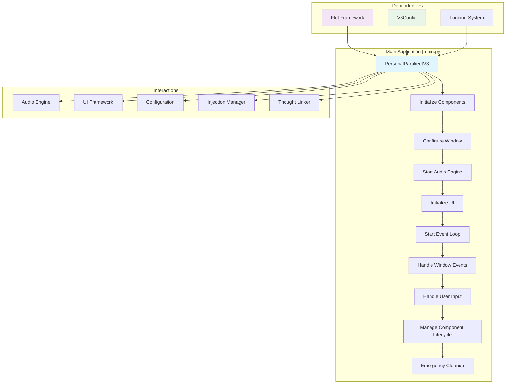
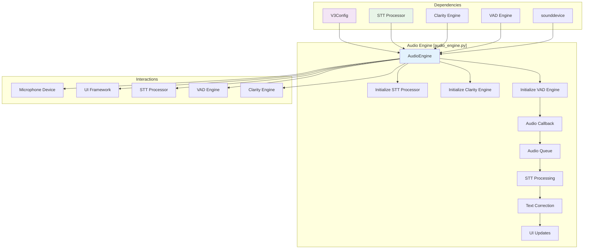
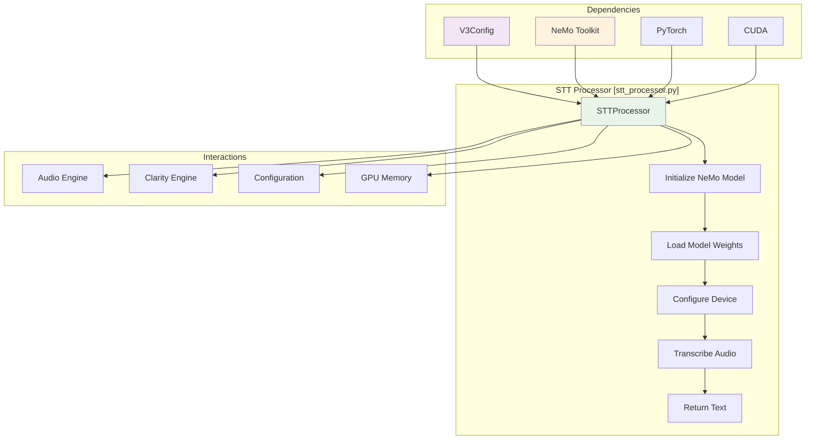
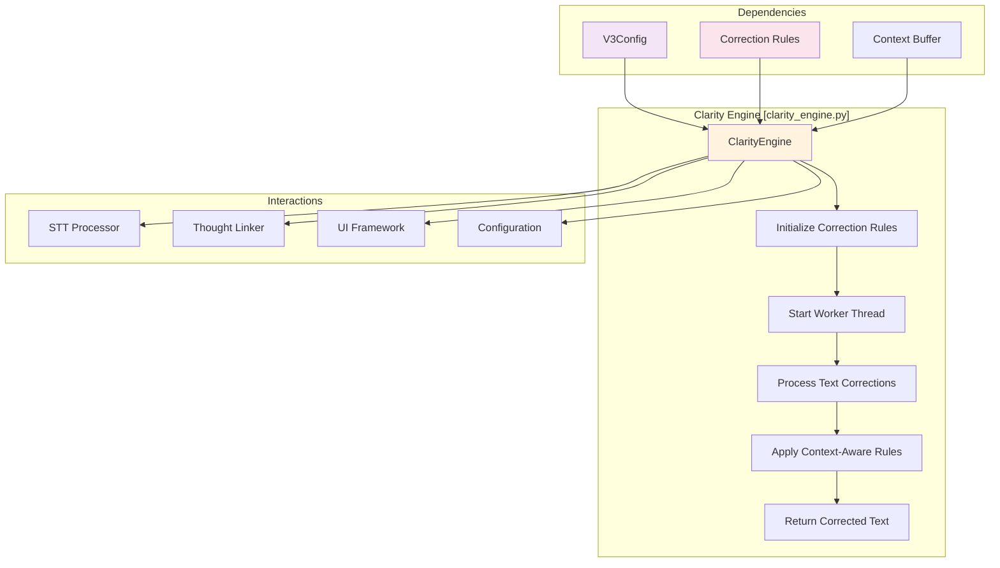
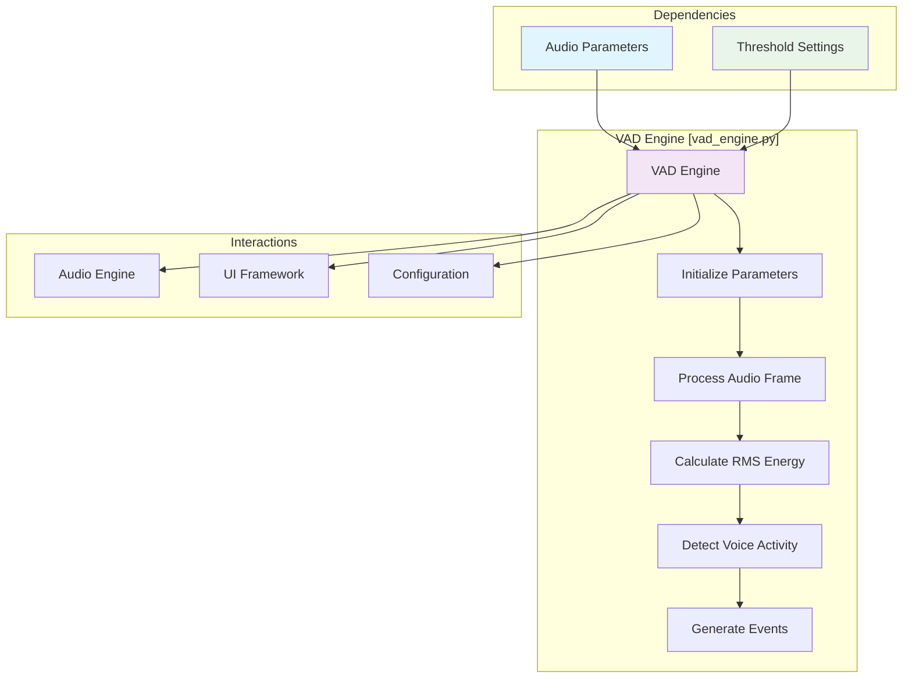
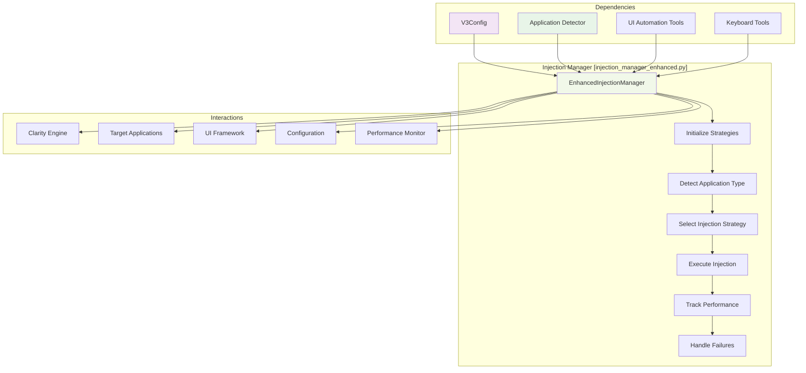
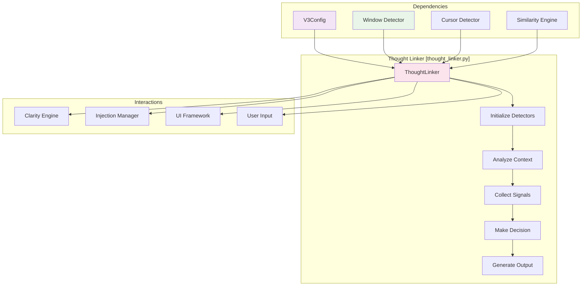
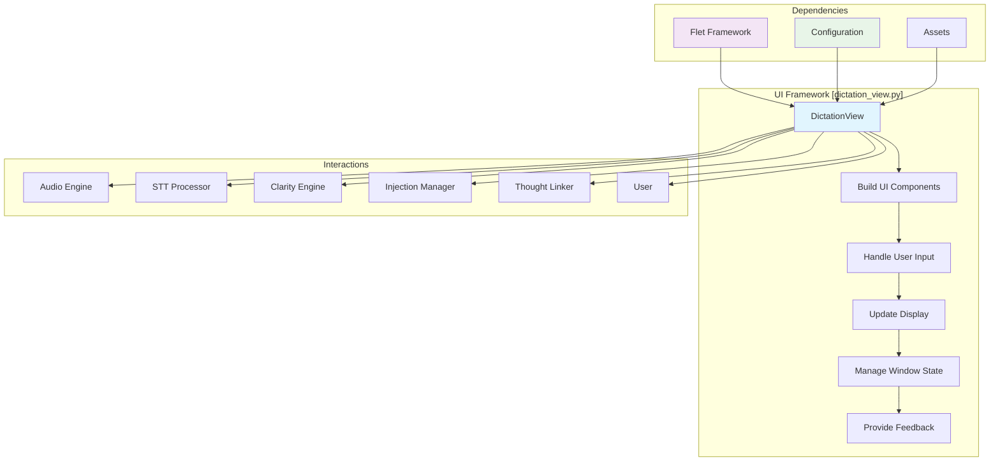

# PersonalParakeet v3 - Component Interaction Analysis

## Component Relationship Matrix

| Component | Depends On | Communicates With | Data Flow | Event Flow |
|-----------|------------|-------------------|-----------|------------|
| **Main Application** | Flet, Config | All Components | Configuration, Events | Lifecycle Events |
| **Audio Engine** | Config, VAD Engine | STT Processor, UI | Audio Data, Status | Audio Events, Status Updates |
| **STT Processor** | Audio Engine, NeMo | Clarity Engine, UI | Transcription Text | Processing Events |
| **Clarity Engine** | STT Processor | Thought Linker, UI | Corrected Text | Correction Events |
| **VAD Engine** | Audio Engine | Audio Engine | Audio Frames | Voice Activity Events |
| **Injection Manager** | Clarity Engine, Config | Target Applications | Corrected Text | Injection Events |
| **Thought Linker** | Clarity Engine, Detectors | Injection Manager, UI | Context Decisions | Context Events |
| **UI Framework** | All Components | User | Display Data | User Events |
| **Configuration** | All Components | All Components | Settings | Configuration Events |

---

## Detailed Component Interactions

### 1. Main Application Component



**Key Interactions**:
- **Initialization**: Sequential component startup with dependency validation
- **Event Handling**: Centralized event routing and user input processing
- **Lifecycle Management**: Component startup, shutdown, and error recovery
- **Configuration**: Central configuration management and distribution

### 2. Audio Engine Component



**Key Interactions**:
- **Audio Capture**: Real-time microphone input with device management
- **Queue Management**: Thread-safe audio chunk queuing and retrieval
- **VAD Processing**: Voice activity detection with pause detection
- **STT Integration**: Asynchronous speech-to-text processing
- **UI Communication**: Real-time transcription updates via callbacks

### 3. STT Processor Component



**Key Interactions**:
- **Model Loading**: Dynamic model loading from local or remote sources
- **Device Management**: GPU/CPU device selection and optimization
- **Audio Processing**: Synchronous transcription with memory management
- **Error Handling**: CUDA OOM errors and model loading failures
- **Performance**: Float16 optimization for GPU memory efficiency

### 4. Clarity Engine Component



**Key Interactions**:
- **Rule Processing**: Jargon and homophone correction with context awareness
- **Async Processing**: Non-blocking corrections with worker thread
- **Context Management**: Maintaining conversation context for better corrections
- **Performance**: Target <50ms processing time for real-time feedback
- **Callback System**: Event-driven correction results

### 5. VAD Engine Component



**Key Interactions**:
- **Frame Processing**: Real-time audio frame analysis
- **Event Generation**: Voice start/end and pause detection events
- **Callback System**: Event-driven notifications to other components
- **Parameter Configuration**: Dynamic threshold adjustment
- **State Management**: Maintaining voice activity state

### 6. Injection Manager Component



**Key Interactions**:
- **Strategy Selection**: Dynamic strategy selection based on application type
- **Performance Tracking**: Success rate and latency monitoring
- **Fallback Mechanisms**: Automatic strategy switching on failure
- **Application Detection**: Real-time application identification
- **Error Recovery**: Comprehensive error handling and retry logic

### 7. Thought Linker Component



**Key Interactions**:
- **Context Analysis**: Multi-signal context analysis for intelligent linking
- **Signal Collection**: Window changes, cursor movement, user actions
- **Decision Making**: Sophisticated algorithm for thought linking decisions
- **Event Generation**: Context-aware linking decisions
- **Configuration**: Dynamic parameter adjustment

### 8. UI Framework Component



**Key Interactions**:
- **Real-time Updates**: Live transcription and correction display
- **User Input**: Mouse, keyboard, and voice command handling
- **Window Management**: Floating window positioning and transparency
- **Status Display**: System status and performance indicators
- **User Feedback**: Visual and audio feedback for system events

---

## Communication Patterns

### 1. Synchronous Communication
- **Configuration Loading**: Main → Components (sync)
- **Audio Processing**: Audio Engine → STT Processor (sync in thread)
- **Text Correction**: Clarity Engine → Rules (sync)

### 2. Asynchronous Communication
- **UI Updates**: All Components → UI (async via callbacks)
- **Audio Events**: Audio Engine → UI (async events)
- **Injection Events**: Injection Manager → UI (async callbacks)

### 3. Event-Driven Communication
- **Voice Activity**: VAD Engine → All Components (events)
- **User Actions**: UI → Components (events)
- **System Events**: Main → Components (lifecycle events)

### 4. Queue-Based Communication
- **Audio Data**: Audio Engine → STT Processor (queue.Queue)
- **Correction Requests**: UI → Clarity Engine (queue.Queue)

---

## Data Flow Analysis

### 1. Audio Data Flow
```
Microphone → Audio Engine → Audio Queue → STT Processor → 
Raw Transcription → Clarity Engine → Corrected Text → 
Thought Linker → Injection Manager → Target Application
```

### 2. Configuration Data Flow
```
Config File → Configuration Manager → All Components → 
Runtime Updates → Configuration Manager → Component Updates
```

### 3. Event Data Flow
```
User Input → UI Framework → Event Handler → 
Component Notification → Component Processing → 
UI Update → User Feedback
```

### 4. Error Data Flow
```
Component Error → Error Handler → Logging System → 
User Notification → Recovery Attempt → Status Update
```

---

## Performance Considerations

### 1. Latency Targets
- **Audio Capture**: <10ms
- **VAD Processing**: <5ms
- **STT Processing**: <150ms
- **Text Correction**: <50ms
- **Injection**: <100ms
- **UI Updates**: <16ms (60 FPS)

### 2. Throughput Requirements
- **Audio Chunks**: 100ms chunks (10 chunks/second)
- **Queue Capacity**: 50 chunks (5 seconds buffer)
- **Concurrent Processing**: Multiple threads for parallel operations

### 3. Memory Usage
- **STT Model**: 2-4GB GPU memory
- **Audio Buffers**: ~100MB
- **Context Storage**: ~10MB
- **UI Components**: ~50MB

---

## Error Handling Patterns

### 1. Component-Level Error Handling
- **Graceful Degradation**: Continue with reduced functionality
- **Error Recovery**: Automatic retry and fallback mechanisms
- **User Notification**: Clear error messages and status updates

### 2. System-Level Error Handling
- **Emergency Cleanup**: Resource cleanup on critical failures
- **State Recovery**: Restore stable state after errors
- **Logging**: Comprehensive error logging for debugging

### 3. User-Level Error Handling
- **Friendly Messages**: Technical error descriptions for users
- **Recovery Suggestions**: Actionable steps to resolve issues
- **Fallback Options**: Alternative methods when primary methods fail

---

## Scalability Considerations

### 1. Component Independence
- **Loose Coupling**: Components communicate through well-defined interfaces
- **State Management**: Each component manages its own state
- **Dependency Injection**: Easy to swap implementations

### 2. Resource Management
- **Memory Management**: Proper cleanup and garbage collection
- **Thread Management**: Optimal thread pool configuration
- **Connection Pooling**: Efficient resource reuse

### 3. Performance Optimization
- **Caching**: Intelligent caching for expensive operations
- **Lazy Loading**: Load resources only when needed
- **Parallel Processing**: Multi-threading for CPU-intensive tasks

This component interaction analysis provides a comprehensive view of how PersonalParakeet v3 components work together, their dependencies, communication patterns, and performance characteristics.