# PersonalParakeet v3 - Detailed Component Diagrams

## 1. Audio Engine Detailed Architecture

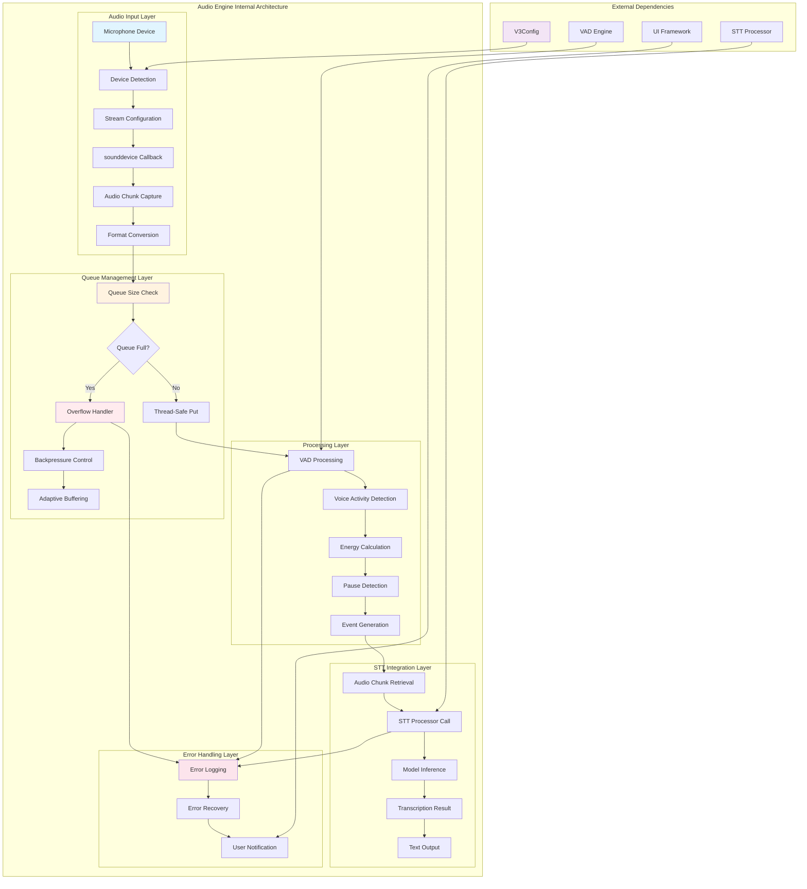
```mermaid
graph TB
    subgraph "Audio Engine Internal Architecture"
        subgraph "Audio Input Layer"
            A[Microphone Device] --> B[Device Detection]
            B --> C[Stream Configuration]
            C --> D[sounddevice Callback]
            D --> E[Audio Chunk Capture]
            E --> F[Format Conversion]
        end
        
        subgraph "Queue Management Layer"
            F --> G[Queue Size Check]
            G --> H{Queue Full?}
            H -->|No| I[Thread-Safe Put]
            H -->|Yes| J[Overflow Handler]
            J --> K[Backpressure Control]
            K --> L[Adaptive Buffering]
        end
        
        subgraph "Processing Layer"
            I --> M[VAD Processing]
            M --> N[Voice Activity Detection]
            N --> O[Energy Calculation]
            O --> P[Pause Detection]
            P --> Q[Event Generation]
        end
        
        subgraph "STT Integration Layer"
            Q --> R[Audio Chunk Retrieval]
            R --> S[STT Processor Call]
            S --> T[Model Inference]
            T --> U[Transcription Result]
            U --> V[Text Output]
        end
        
        subgraph "Error Handling Layer"
            J --> W[Error Logging]
            M --> W
            S --> W
            W --> X[Error Recovery]
            X --> Y[User Notification]
        end
    end
    
    subgraph "External Dependencies"
        Z[V3Config] --> B
        AA[VAD Engine] --> M
        BB[STT Processor] --> S
        CC[UI Framework] --> Y
    end
    
    style A fill:#e1f5fe
    style G fill:#fff3e0
    style J fill:#ffebee
    style W fill:#fce4ec
    style Z fill:#f3e5f5
```

### Audio Engine Key Components

#### 1.1 Device Management
```mermaid
graph TD
    A[Device Discovery] --> B[Available Devices]
    B --> C[Default Device Selection]
    C --> D[Device Configuration]
    D --> E[Stream Parameters]
    E --> F[sounddevice Stream]
    F --> G[Audio Callback]
    
    subgraph "Device Configuration"
        H[Sample Rate] --> I[48000 Hz]
        J[Channels] --> K[Mono (1)]
        L[DType] --> M[Float32]
        N[Block Size] --> O[1024 samples]
    end
    
    D --> H
    D --> J
    D --> L
    D --> N
    
    style I fill:#e8f5e8
    style K fill:#e8f5e8
    style M fill:#e8f5e8
    style O fill:#e8f5e8
```

#### 1.2 Queue Management System
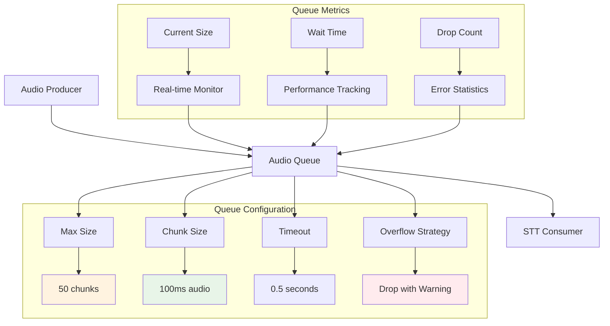
```mermaid
graph TD
    A[Audio Producer] --> B[Audio Queue]
    B --> C[STT Consumer]
    
    subgraph "Queue Configuration"
        D[Max Size] --> E[50 chunks]
        F[Chunk Size] --> G[100ms audio]
        H[Timeout] --> I[0.5 seconds]
        J[Overflow Strategy] --> K[Drop with Warning]
    end
    
    subgraph "Queue Metrics"
        L[Current Size] --> M[Real-time Monitor]
        N[Wait Time] --> O[Performance Tracking]
        P[Drop Count] --> Q[Error Statistics]
    end
    
    B --> D
    B --> F
    B --> H
    B --> J
    M --> B
    O --> B
    Q --> B
    
    style E fill:#fff3e0
    style G fill:#e8f5e8
    style K fill:#ffebee
```

#### 1.3 VAD Processing Pipeline
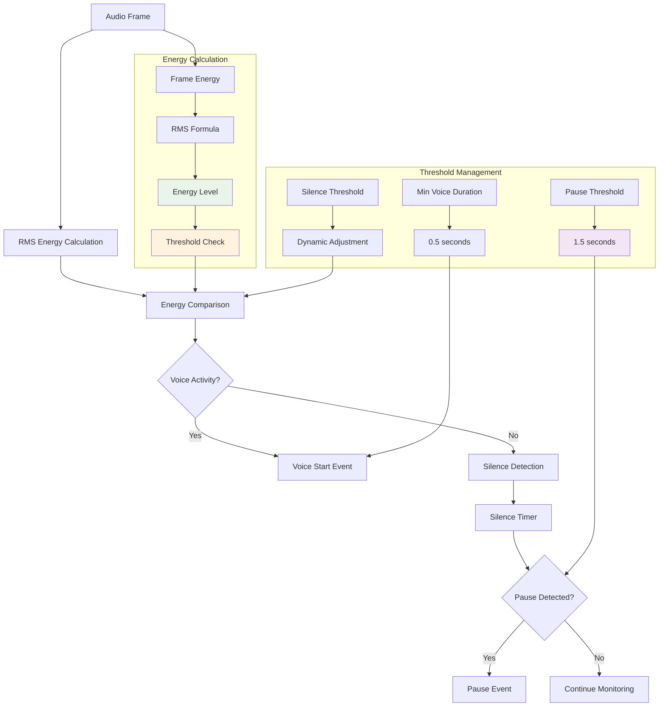
```mermaid
graph TD
    A[Audio Frame] --> B[RMS Energy Calculation]
    B --> C[Energy Comparison]
    C --> D{Voice Activity?}
    D -->|Yes| E[Voice Start Event]
    D -->|No| F[Silence Detection]
    
    F --> G[Silence Timer]
    G --> H{Pause Detected?}
    H -->|Yes| I[Pause Event]
    H -->|No| J[Continue Monitoring]
    
    subgraph "Energy Calculation"
        K[Frame Energy] --> L[RMS Formula]
        L --> M[Energy Level]
        M --> N[Threshold Check]
    end
    
    subgraph "Threshold Management"
        O[Silence Threshold] --> P[Dynamic Adjustment]
        Q[Pause Threshold] --> R[1.5 seconds]
        S[Min Voice Duration] --> T[0.5 seconds]
    end
    
    A --> K
    N --> C
    P --> C
    R --> H
    T --> E
    
    style M fill:#e8f5e8
    style N fill:#fff3e0
    style R fill:#f3e5f5
```

---

## 2. STT Processor Detailed Architecture

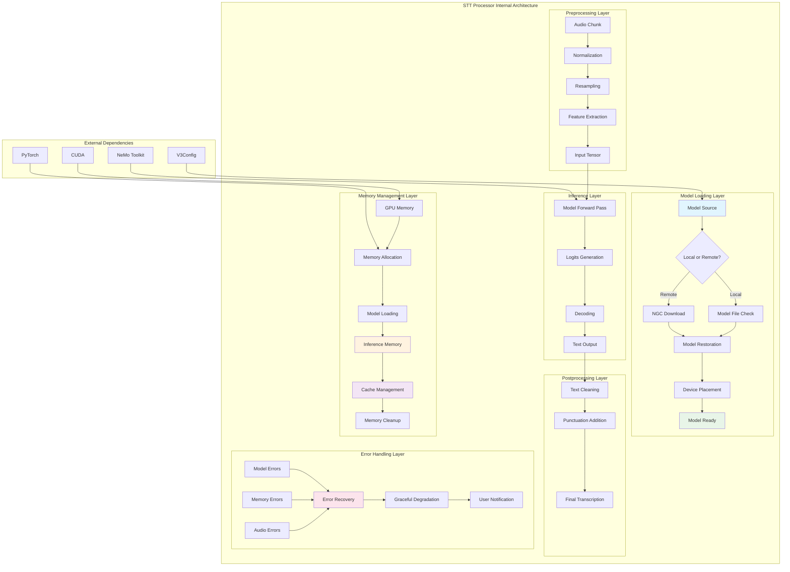
```mermaid
graph TB
    subgraph "STT Processor Internal Architecture"
        subgraph "Model Loading Layer"
            A[Model Source] --> B{Local or Remote?}
            B -->|Local| C[Model File Check]
            B -->|Remote| D[NGC Download]
            C --> E[Model Restoration]
            D --> E
            E --> F[Device Placement]
            F --> G[Model Ready]
        end
        
        subgraph "Preprocessing Layer"
            H[Audio Chunk] --> I[Normalization]
            I --> J[Resampling]
            J --> K[Feature Extraction]
            K --> L[Input Tensor]
        end
        
        subgraph "Inference Layer"
            L --> M[Model Forward Pass]
            M --> N[Logits Generation]
            N --> O[Decoding]
            O --> P[Text Output]
        end
        
        subgraph "Postprocessing Layer"
            P --> Q[Text Cleaning]
            Q --> R[Punctuation Addition]
            R --> S[Final Transcription]
        end
        
        subgraph "Memory Management Layer"
            T[GPU Memory] --> U[Memory Allocation]
            U --> V[Model Loading]
            V --> W[Inference Memory]
            W --> X[Cache Management]
            X --> Y[Memory Cleanup]
        end
        
        subgraph "Error Handling Layer"
            Z[Model Errors] --> AA[Error Recovery]
            BB[Memory Errors] --> AA
            CC[Audio Errors] --> AA
            AA --> DD[Graceful Degradation]
            DD --> EE[User Notification]
        end
    end
    
    subgraph "External Dependencies"
        FF[V3Config] --> A
        GG[NeMo Toolkit] --> M
        HH[PyTorch] --> U
        II[CUDA] --> T
    end
    
    style A fill:#e1f5fe
    style G fill:#e8f5e8
    style W fill:#fff3e0
    style X fill:#f3e5f5
    style AA fill:#fce4ec
```

### STT Processor Key Components

#### 2.1 Model Management System
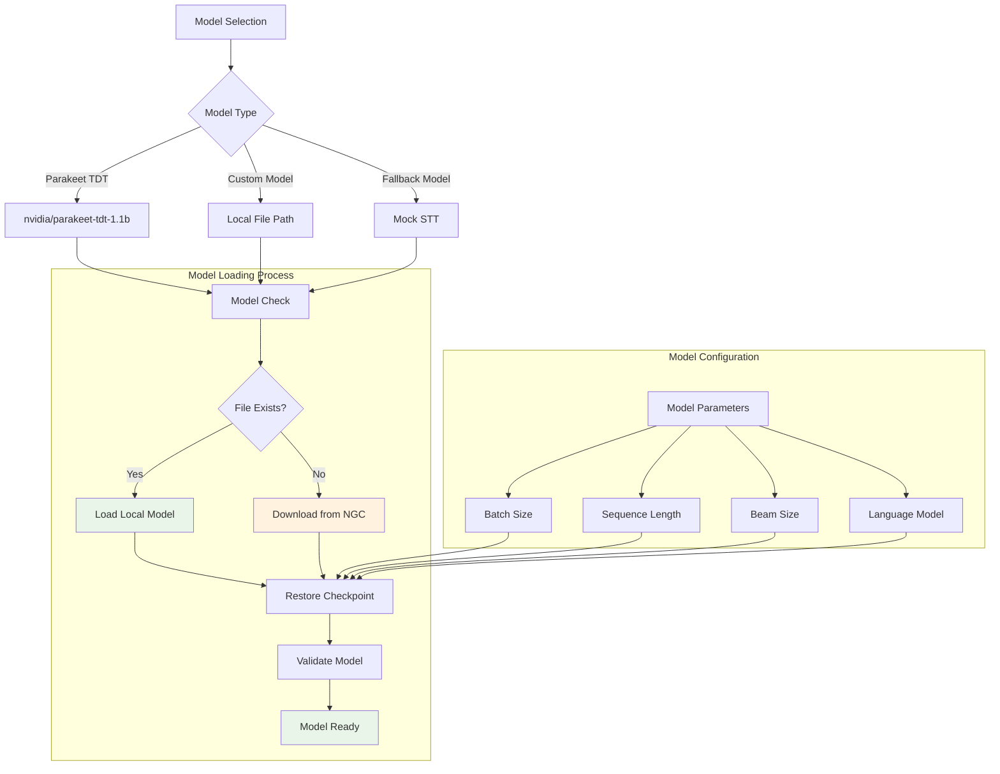
```mermaid
graph TD
    A[Model Selection] --> B{Model Type}
    B -->|Parakeet TDT| C[nvidia/parakeet-tdt-1.1b]
    B -->|Custom Model| D[Local File Path]
    B -->|Fallback Model| E[Mock STT]
    
    subgraph "Model Loading Process"
        F[Model Check] --> G{File Exists?}
        G -->|Yes| H[Load Local Model]
        G -->|No| I[Download from NGC]
        H --> J[Restore Checkpoint]
        I --> J
        J --> K[Validate Model]
        K --> L[Model Ready]
    end
    
    subgraph "Model Configuration"
        M[Model Parameters] --> N[Batch Size]
        M --> O[Sequence Length]
        M --> P[Beam Size]
        M --> Q[Language Model]
    end
    
    C --> F
    D --> F
    E --> F
    N --> J
    O --> J
    P --> J
    Q --> J
    
    style H fill:#e8f5e8
    style I fill:#fff3e0
    style L fill:#e8f5e8
```

#### 2.2 GPU Memory Management
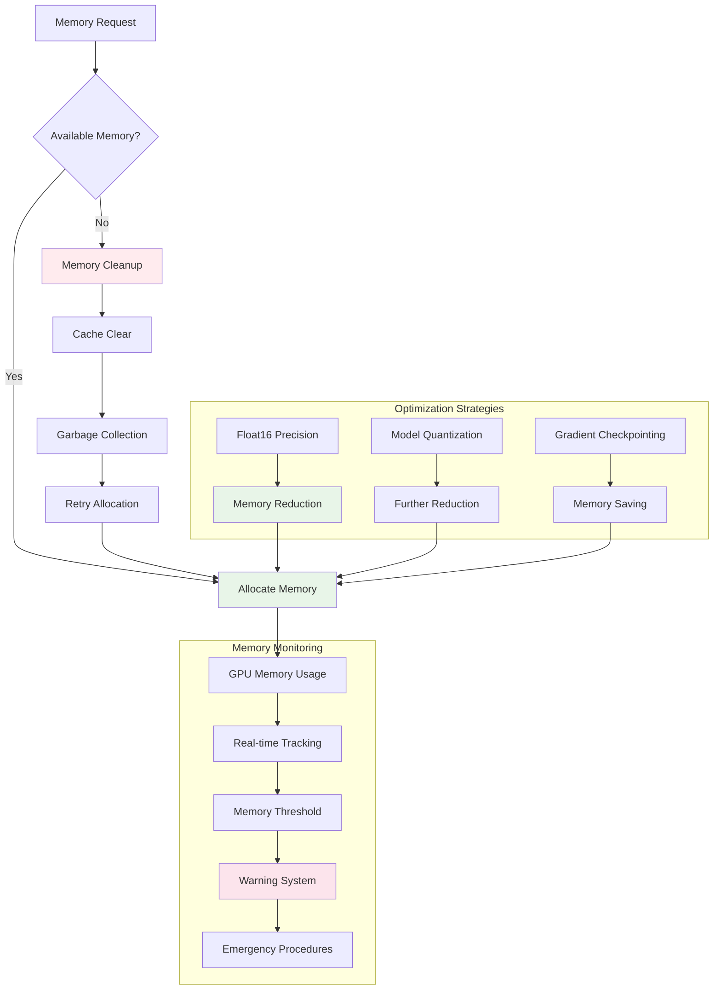
```mermaid
graph TD
    A[Memory Request] --> B{Available Memory?}
    B -->|Yes| C[Allocate Memory]
    B -->|No| D[Memory Cleanup]
    D --> E[Cache Clear]
    E --> F[Garbage Collection]
    F --> G[Retry Allocation]
    
    subgraph "Memory Monitoring"
        H[GPU Memory Usage] --> I[Real-time Tracking]
        I --> J[Memory Threshold]
        J --> K[Warning System]
        K --> L[Emergency Procedures]
    end
    
    subgraph "Optimization Strategies"
        M[Float16 Precision] --> N[Memory Reduction]
        O[Model Quantization] --> P[Further Reduction]
        Q[Gradient Checkpointing] --> R[Memory Saving]
    end
    
    C --> H
    G --> C
    N --> C
    P --> C
    R --> C
    
    style C fill:#e8f5e8
    style D fill:#ffebee
    style K fill:#fce4ec
    style N fill:#e8f5e8
```

#### 2.3 Audio Preprocessing Pipeline
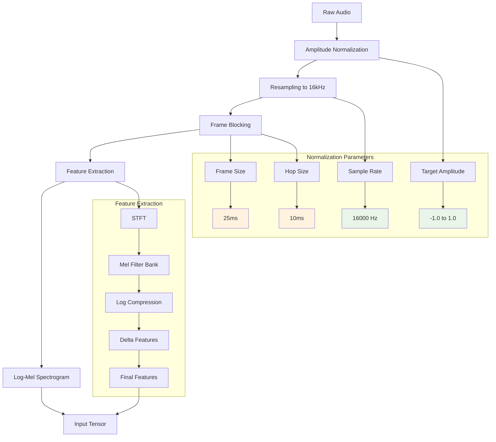
```mermaid
graph TD
    A[Raw Audio] --> B[Amplitude Normalization]
    B --> C[Resampling to 16kHz]
    C --> D[Frame Blocking]
    D --> E[Feature Extraction]
    E --> F[Log-Mel Spectrogram]
    F --> G[Input Tensor]
    
    subgraph "Normalization Parameters"
        H[Target Amplitude] --> I[-1.0 to 1.0]
        J[Sample Rate] --> K[16000 Hz]
        L[Frame Size] --> M[25ms]
        N[Hop Size] --> O[10ms]
    end
    
    subgraph "Feature Extraction"
        P[STFT] --> Q[Mel Filter Bank]
        Q --> R[Log Compression]
        R --> S[Delta Features]
        S --> T[Final Features]
    end
    
    B --> H
    C --> J
    D --> L
    D --> N
    E --> P
    T --> G
    
    style I fill:#e8f5e8
    style K fill:#e8f5e8
    style M fill:#fff3e0
    style O fill:#fff3e0
```

---

## 3. Clarity Engine Detailed Architecture

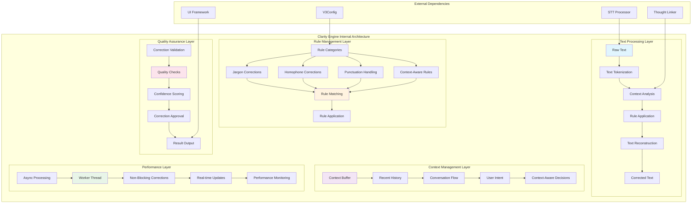
```mermaid
graph TB
    subgraph "Clarity Engine Internal Architecture"
        subgraph "Text Processing Layer"
            A[Raw Text] --> B[Text Tokenization]
            B --> C[Context Analysis]
            C --> D[Rule Application]
            D --> E[Text Reconstruction]
            E --> F[Corrected Text]
        end
        
        subgraph "Rule Management Layer"
            G[Rule Categories] --> H[Jargon Corrections]
            G --> I[Homophone Corrections]
            G --> J[Punctuation Handling]
            G --> K[Context-Aware Rules]
            H --> L[Rule Matching]
            I --> L
            J --> L
            K --> L
            L --> M[Rule Application]
        end
        
        subgraph "Context Management Layer"
            N[Context Buffer] --> O[Recent History]
            O --> P[Conversation Flow]
            P --> Q[User Intent]
            Q --> R[Context-Aware Decisions]
        end
        
        subgraph "Performance Layer"
            S[Async Processing] --> T[Worker Thread]
            T --> U[Non-Blocking Corrections]
            U --> V[Real-time Updates]
            V --> W[Performance Monitoring]
        end
        
        subgraph "Quality Assurance Layer"
            X[Correction Validation] --> Y[Quality Checks]
            Y --> Z[Confidence Scoring]
            Z --> AA[Correction Approval]
            AA --> BB[Result Output]
        end
    end
    
    subgraph "External Dependencies"
        CC[V3Config] --> G
        DD[STT Processor] --> A
        EE[UI Framework] --> BB
        FF[Thought Linker] --> C
    end
    
    style A fill:#e1f5fe
    style L fill:#fff3e0
    style N fill:#f3e5f5
    style T fill:#e8f5e8
    style Y fill:#fce4ec
```

### Clarity Engine Key Components

#### 3.1 Rule-Based Correction System
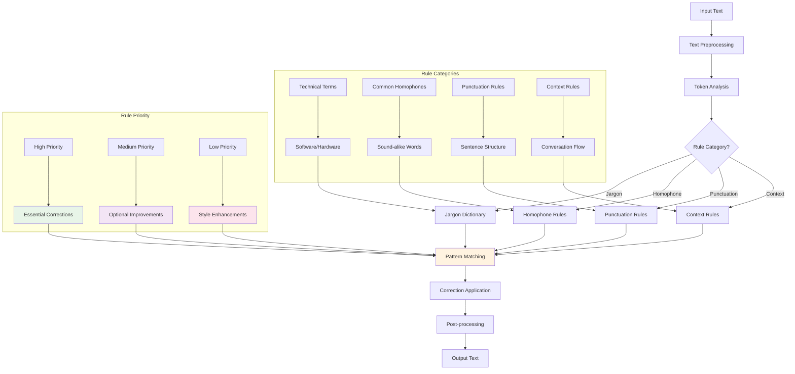
```mermaid
graph TD
    A[Input Text] --> B[Text Preprocessing]
    B --> C[Token Analysis]
    C --> D{Rule Category?}
    D -->|Jargon| E[Jargon Dictionary]
    D -->|Homophone| F[Homophone Rules]
    D -->|Punctuation| G[Punctuation Rules]
    D -->|Context| H[Context Rules]
    
    E --> I[Pattern Matching]
    F --> I
    G --> I
    H --> I
    I --> J[Correction Application]
    J --> K[Post-processing]
    K --> L[Output Text]
    
    subgraph "Rule Categories"
        M[Technical Terms] --> N[Software/Hardware]
        O[Common Homophones] --> P[Sound-alike Words]
        Q[Punctuation Rules] --> R[Sentence Structure]
        S[Context Rules] --> T[Conversation Flow]
    end
    
    subgraph "Rule Priority"
        U[High Priority] --> V[Essential Corrections]
        W[Medium Priority] --> X[Optional Improvements]
        Y[Low Priority] --> Z[Style Enhancements]
    end
    
    N --> E
    P --> F
    R --> G
    T --> H
    V --> I
    X --> I
    Z --> I
    
    style I fill:#fff3e0
    style V fill:#e8f5e8
    style X fill:#f3e5f5
    style Z fill:#fce4ec
```

#### 3.2 Context Management System
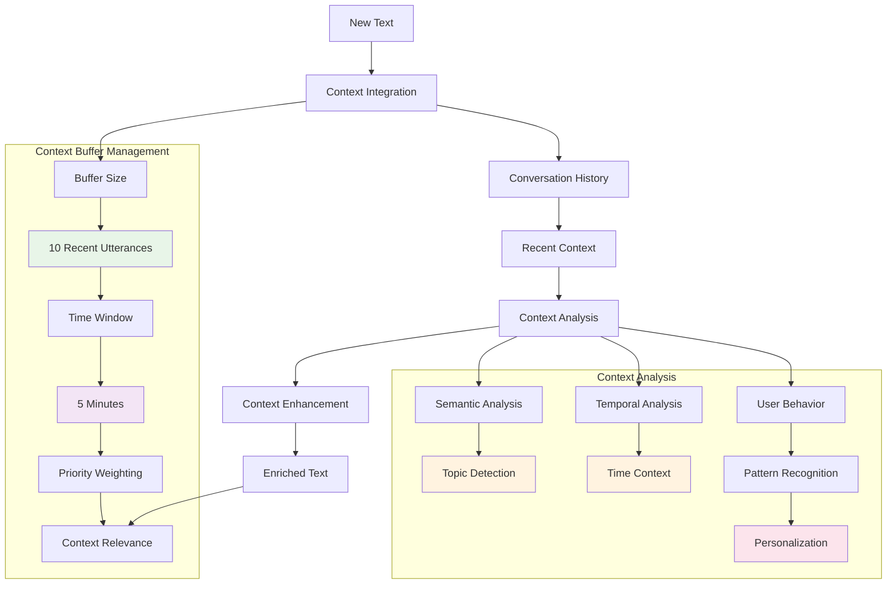
```mermaid
graph TD
    A[New Text] --> B[Context Integration]
    B --> C[Conversation History]
    C --> D[Recent Context]
    D --> E[Context Analysis]
    E --> F[Context Enhancement]
    F --> G[Enriched Text]
    
    subgraph "Context Buffer Management"
        H[Buffer Size] --> I[10 Recent Utterances]
        I --> J[Time Window]
        J --> K[5 Minutes]
        K --> L[Priority Weighting]
        L --> M[Context Relevance]
    end
    
    subgraph "Context Analysis"
        N[Semantic Analysis] --> O[Topic Detection]
        P[Temporal Analysis] --> Q[Time Context]
        R[User Behavior] --> S[Pattern Recognition]
        S --> T[Personalization]
    end
    
    B --> H
    E --> N
    E --> P
    E --> R
    G --> M
    
    style I fill:#e8f5e8
    style K fill:#f3e5f5
    style O fill:#fff3e0
    style Q fill:#fff3e0
    style T fill:#fce4ec
```

#### 3.3 Async Processing Pipeline
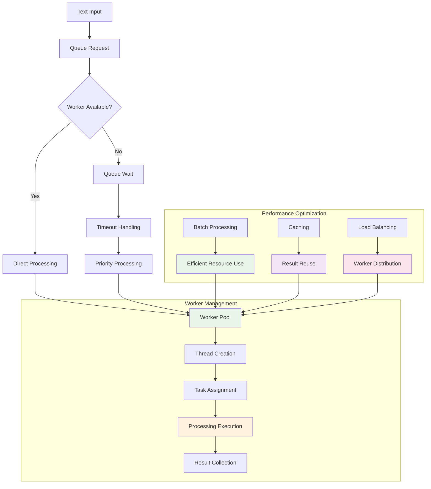
```mermaid
graph TD
    A[Text Input] --> B[Queue Request]
    B --> C{Worker Available?}
    C -->|Yes| D[Direct Processing]
    C -->|No| E[Queue Wait]
    E --> F[Timeout Handling]
    F --> G[Priority Processing]
    
    subgraph "Worker Management"
        H[Worker Pool] --> I[Thread Creation]
        I --> J[Task Assignment]
        J --> K[Processing Execution]
        K --> L[Result Collection]
    end
    
    subgraph "Performance Optimization"
        M[Batch Processing] --> N[Efficient Resource Use]
        O[Caching] --> P[Result Reuse]
        Q[Load Balancing] --> R[Worker Distribution]
    end
    
    D --> H
    G --> H
    N --> H
    P --> H
    R --> H
    
    style H fill:#e8f5e8
    style K fill:#fff3e0
    style N fill:#e8f5e8
    style P fill:#f3e5f5
    style R fill:#fce4ec
```

---

## 4. Injection Manager Detailed Architecture

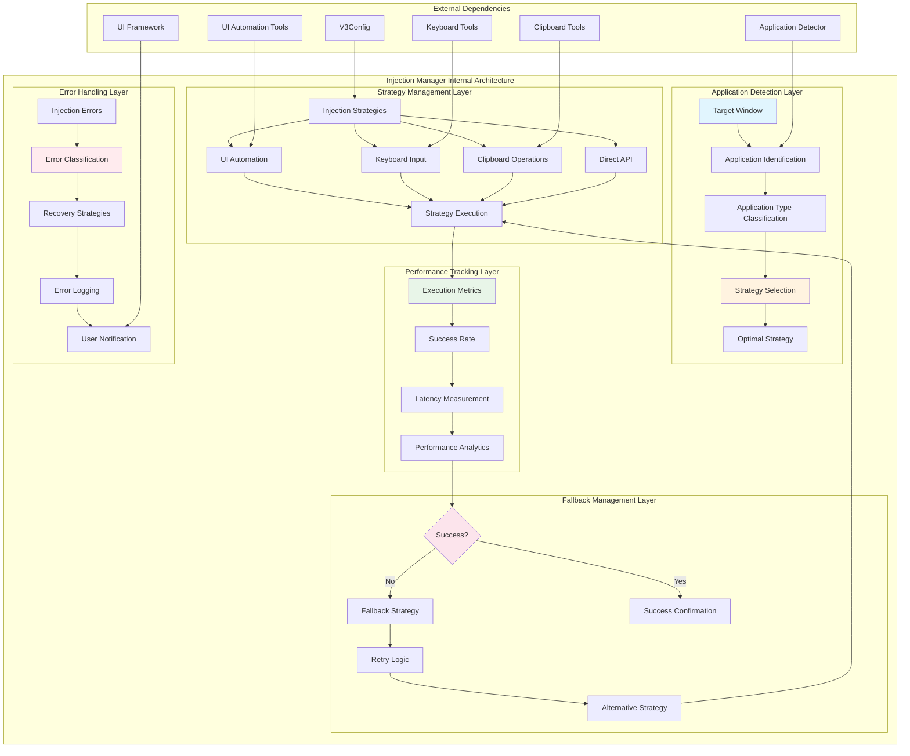
```mermaid
graph TB
    subgraph "Injection Manager Internal Architecture"
        subgraph "Application Detection Layer"
            A[Target Window] --> B[Application Identification]
            B --> C[Application Type Classification]
            C --> D[Strategy Selection]
            D --> E[Optimal Strategy]
        end
        
        subgraph "Strategy Management Layer"
            F[Injection Strategies] --> G[UI Automation]
            F --> H[Keyboard Input]
            F --> I[Clipboard Operations]
            F --> J[Direct API]
            G --> K[Strategy Execution]
            H --> K
            I --> K
            J --> K
        end
        
        subgraph "Performance Tracking Layer"
            K --> L[Execution Metrics]
            L --> M[Success Rate]
            M --> N[Latency Measurement]
            N --> O[Performance Analytics]
        end
        
        subgraph "Fallback Management Layer"
            O --> P{Success?}
            P -->|No| Q[Fallback Strategy]
            P -->|Yes| R[Success Confirmation]
            Q --> S[Retry Logic]
            S --> T[Alternative Strategy]
            T --> K
        end
        
        subgraph "Error Handling Layer"
            U[Injection Errors] --> V[Error Classification]
            V --> W[Recovery Strategies]
            W --> X[Error Logging]
            X --> Y[User Notification]
        end
    end
    
    subgraph "External Dependencies"
        AA[V3Config] --> F
        BB[Application Detector] --> B
        CC[UI Automation Tools] --> G
        DD[Keyboard Tools] --> H
        EE[Clipboard Tools] --> I
        FF[UI Framework] --> Y
    end
    
    style A fill:#e1f5fe
    style D fill:#fff3e0
    style L fill:#e8f5e8
    style P fill:#fce4ec
    style V fill:#ffebee
```

### Injection Manager Key Components

#### 4.1 Strategy Selection System
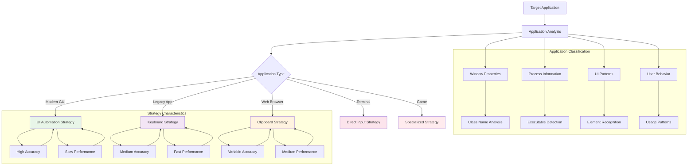
```mermaid
graph TD
    A[Target Application] --> B[Application Analysis]
    B --> C{Application Type}
    C -->|Modern GUI| D[UI Automation Strategy]
    C -->|Legacy App| E[Keyboard Strategy]
    C -->|Web Browser| F[Clipboard Strategy]
    C -->|Terminal| G[Direct Input Strategy]
    C -->|Game| H[Specialized Strategy]
    
    subgraph "Application Classification"
        I[Window Properties] --> J[Class Name Analysis]
        K[Process Information] --> L[Executable Detection]
        M[UI Patterns] --> N[Element Recognition]
        O[User Behavior] --> P[Usage Patterns]
    end
    
    subgraph "Strategy Characteristics"
        D --> Q[High Accuracy]
        D --> R[Slow Performance]
        E --> S[Medium Accuracy]
        E --> T[Fast Performance]
        F --> U[Variable Accuracy]
        F --> V[Medium Performance]
    end
    
    B --> I
    B --> K
    B --> M
    B --> O
    Q --> D
    R --> D
    S --> E
    T --> E
    U --> F
    V --> F
    
    style D fill:#e8f5e8
    style E fill:#f3e5f5
    style F fill:#fff3e0
    style G fill:#fce4ec
    style H fill:#ffebee
```

#### 4.2 Performance Tracking System
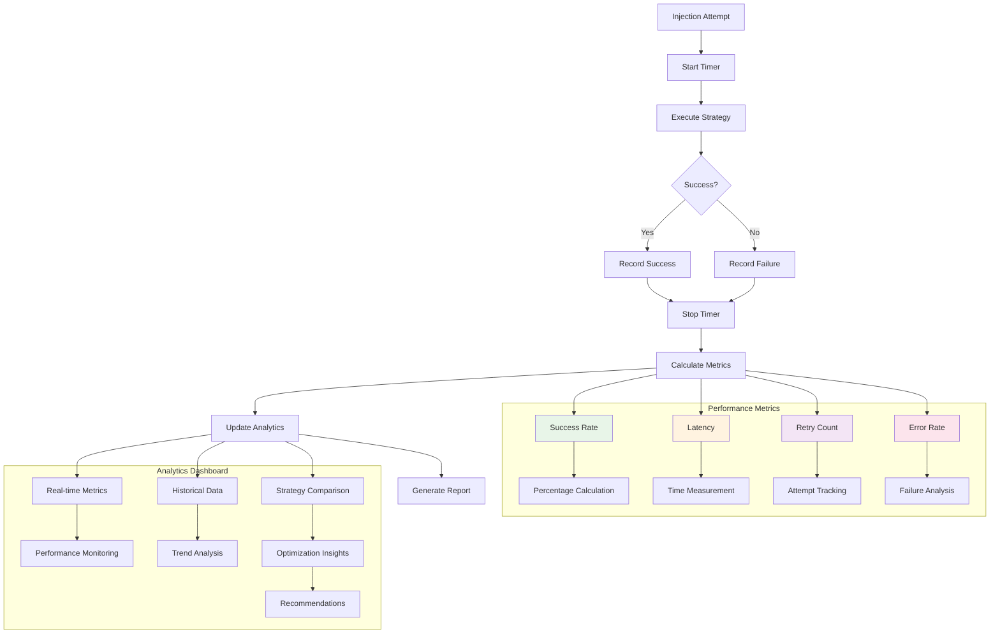
```mermaid
graph TD
    A[Injection Attempt] --> B[Start Timer]
    B --> C[Execute Strategy]
    C --> D{Success?}
    D -->|Yes| E[Record Success]
    D -->|No| F[Record Failure]
    E --> G[Stop Timer]
    F --> G
    G --> H[Calculate Metrics]
    H --> I[Update Analytics]
    I --> J[Generate Report]
    
    subgraph "Performance Metrics"
        K[Success Rate] --> L[Percentage Calculation]
        M[Latency] --> N[Time Measurement]
        O[Retry Count] --> P[Attempt Tracking]
        Q[Error Rate] --> R[Failure Analysis]
    end
    
    subgraph "Analytics Dashboard"
        S[Real-time Metrics] --> T[Performance Monitoring]
        U[Historical Data] --> V[Trend Analysis]
        W[Strategy Comparison] --> X[Optimization Insights]
        X --> Y[Recommendations]
    end
    
    H --> K
    H --> M
    H --> O
    H --> Q
    I --> S
    I --> U
    I --> W
    
    style K fill:#e8f5e8
    style M fill:#fff3e0
    style O fill:#f3e5f5
    style Q fill:#fce4ec
```

#### 4.3 Error Recovery System
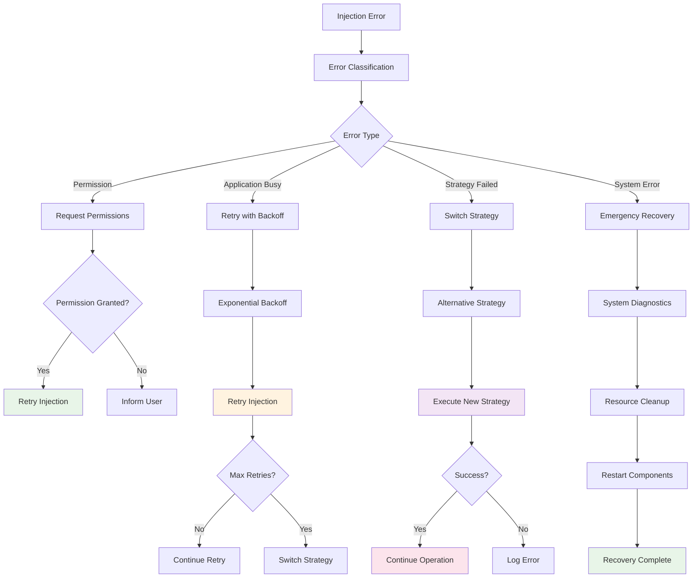
```mermaid
graph TD
    A[Injection Error] --> B[Error Classification]
    B --> C{Error Type}
    C -->|Permission| D[Request Permissions]
    C -->|Application Busy| E[Retry with Backoff]
    C -->|Strategy Failed| F[Switch Strategy]
    C -->|System Error| G[Emergency Recovery]
    
    D --> H{Permission Granted?}
    H -->|Yes| I[Retry Injection]
    H -->|No| J[Inform User]
    
    E --> K[Exponential Backoff]
    K --> L[Retry Injection]
    L --> M{Max Retries?}
    M -->|No| N[Continue Retry]
    M -->|Yes| O[Switch Strategy]
    
    F --> P[Alternative Strategy]
    P --> Q[Execute New Strategy]
    Q --> R{Success?}
    R -->|Yes| S[Continue Operation]
    R -->|No| T[Log Error]
    
    G --> U[System Diagnostics]
    U --> V[Resource Cleanup]
    V --> W[Restart Components]
    W --> X[Recovery Complete]
    
    style I fill:#e8f5e8
    style L fill:#fff3e0
    style Q fill:#f3e5f5
    style S fill:#fce4ec
    style X fill:#e8f5e8
```

---

## 5. Thought Linker Detailed Architecture

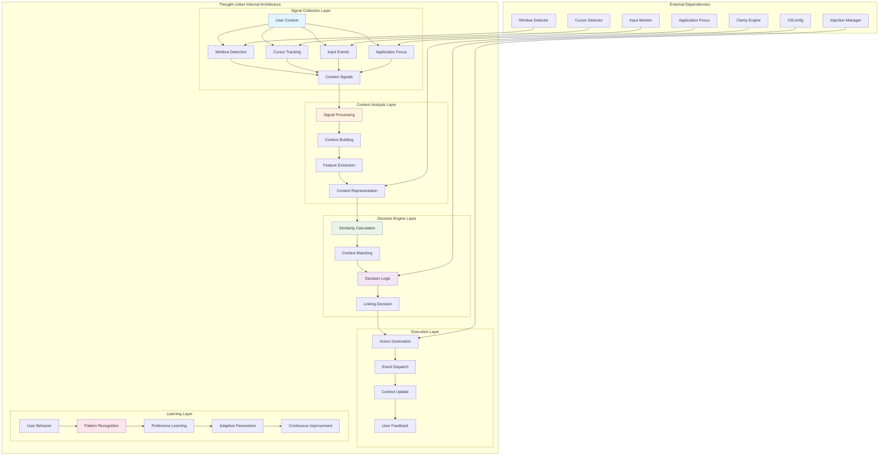
```mermaid
graph TB
    subgraph "Thought Linker Internal Architecture"
        subgraph "Signal Collection Layer"
            A[User Context] --> B[Window Detection]
            A --> C[Cursor Tracking]
            A --> D[Input Events]
            A --> E[Application Focus]
            B --> F[Context Signals]
            C --> F
            D --> F
            E --> F
        end
        
        subgraph "Context Analysis Layer"
            F --> G[Signal Processing]
            G --> H[Context Building]
            H --> I[Feature Extraction]
            I --> J[Context Representation]
        end
        
        subgraph "Decision Engine Layer"
            J --> K[Similarity Calculation]
            K --> L[Context Matching]
            L --> M[Decision Logic]
            M --> N[Linking Decision]
        end
        
        subgraph "Execution Layer"
            N --> O[Action Generation]
            O --> P[Event Dispatch]
            P --> Q[Context Update]
            Q --> R[User Feedback]
        end
        
        subgraph "Learning Layer"
            S[User Behavior] --> T[Pattern Recognition]
            T --> U[Preference Learning]
            U --> V[Adaptive Parameters]
            V --> W[Continuous Improvement]
        end
    end
    
    subgraph "External Dependencies"
        AA[V3Config] --> M
        BB[Window Detector] --> B
        CC[Cursor Detector] --> C
        DD[Input Monitor] --> D
        EE[Application Focus] --> E
        FF[Clarity Engine] --> J
        GG[Injection Manager] --> O
    end
    
    style A fill:#e1f5fe
    style G fill:#fff3e0
    style K fill:#e8f5e8
    style M fill:#f3e5f5
    style T fill:#fce4ec
```

### Thought Linker Key Components

#### 5.1 Signal Collection System
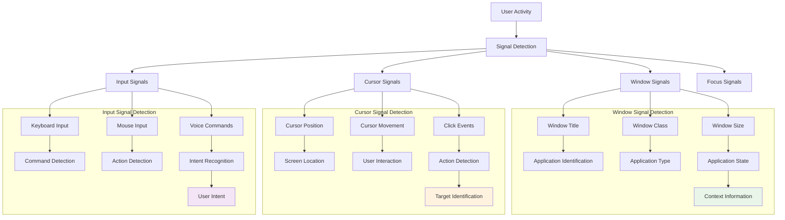
```mermaid
graph TD
    A[User Activity] --> B[Signal Detection]
    B --> C[Window Signals]
    B --> D[Cursor Signals]
    B --> E[Input Signals]
    B --> F[Focus Signals]
    
    subgraph "Window Signal Detection"
        G[Window Title] --> H[Application Identification]
        I[Window Class] --> J[Application Type]
        K[Window Size] --> L[Application State]
        L --> M[Context Information]
    end
    
    subgraph "Cursor Signal Detection"
        N[Cursor Position] --> O[Screen Location]
        P[Cursor Movement] --> Q[User Interaction]
        R[Click Events] --> S[Action Detection]
        S --> T[Target Identification]
    end
    
    subgraph "Input Signal Detection"
        U[Keyboard Input] --> V[Command Detection]
        W[Mouse Input] --> X[Action Detection]
        Y[Voice Commands] --> Z[Intent Recognition]
        Z --> AA[User Intent]
    end
    
    C --> G
    C --> I
    C --> K
    D --> N
    D --> P
    D --> R
    E --> U
    E --> W
    E --> Y
    
    style M fill:#e8f5e8
    style T fill:#fff3e0
    style AA fill:#f3e5f5
```

#### 5.2 Context Analysis Engine
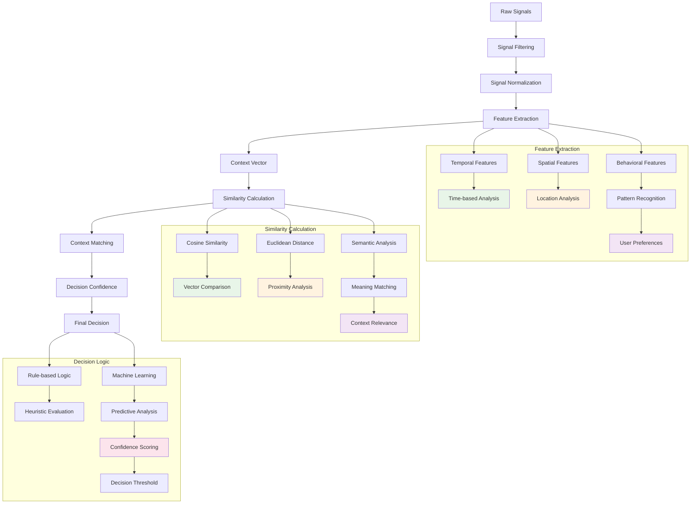
```mermaid
graph TD
    A[Raw Signals] --> B[Signal Filtering]
    B --> C[Signal Normalization]
    C --> D[Feature Extraction]
    D --> E[Context Vector]
    E --> F[Similarity Calculation]
    F --> G[Context Matching]
    G --> H[Decision Confidence]
    H --> I[Final Decision]
    
    subgraph "Feature Extraction"
        J[Temporal Features] --> K[Time-based Analysis]
        L[Spatial Features] --> M[Location Analysis]
        N[Behavioral Features] --> O[Pattern Recognition]
        O --> P[User Preferences]
    end
    
    subgraph "Similarity Calculation"
        Q[Cosine Similarity] --> R[Vector Comparison]
        S[Euclidean Distance] --> T[Proximity Analysis]
        U[Semantic Analysis] --> V[Meaning Matching]
        V --> W[Context Relevance]
    end
    
    subgraph "Decision Logic"
        X[Rule-based Logic] --> Y[Heuristic Evaluation]
        Z[Machine Learning] --> AA[Predictive Analysis]
        AA --> BB[Confidence Scoring]
        BB --> CC[Decision Threshold]
    end
    
    D --> J
    D --> L
    D --> N
    F --> Q
    F --> S
    F --> U
    I --> X
    I --> Z
    
    style K fill:#e8f5e8
    style M fill:#fff3e0
    style P fill:#f3e5f5
    style R fill:#e8f5e8
    style T fill:#fff3e0
    style W fill:#f3e5f5
    style BB fill:#fce4ec
```

#### 5.3 Adaptive Learning System
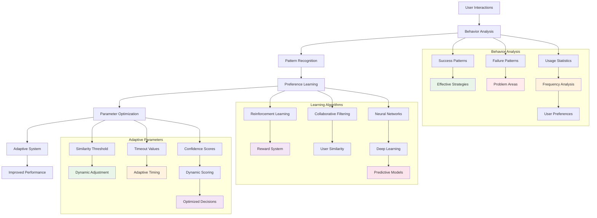
```mermaid
graph TD
    A[User Interactions] --> B[Behavior Analysis]
    B --> C[Pattern Recognition]
    C --> D[Preference Learning]
    D --> E[Parameter Optimization]
    E --> F[Adaptive System]
    F --> G[Improved Performance]
    
    subgraph "Behavior Analysis"
        H[Success Patterns] --> I[Effective Strategies]
        J[Failure Patterns] --> K[Problem Areas]
        L[Usage Statistics] --> M[Frequency Analysis]
        M --> N[User Preferences]
    end
    
    subgraph "Learning Algorithms"
        O[Reinforcement Learning] --> P[Reward System]
        Q[Collaborative Filtering] --> R[User Similarity]
        S[Neural Networks] --> T[Deep Learning]
        T --> U[Predictive Models]
    end
    
    subgraph "Adaptive Parameters"
        V[Similarity Threshold] --> W[Dynamic Adjustment]
        X[Timeout Values] --> Y[Adaptive Timing]
        Z[Confidence Scores] --> AA[Dynamic Scoring]
        AA --> BB[Optimized Decisions]
    end
    
    B --> H
    B --> J
    B --> L
    D --> O
    D --> Q
    D --> S
    E --> V
    E --> X
    E --> Z
    
    style I fill:#e8f5e8
    style K fill:#ffebee
    style M fill:#fff3e0
    style P fill:#f3e5f5
    style U fill:#fce4ec
    style W fill:#e8f5e8
    style Y fill:#fff3e0
    style BB fill:#f3e5f5
```

---

## 6. Configuration System Detailed Architecture

```mermaid
graph TB
    subgraph "Configuration System Internal Architecture"
        subgraph "Configuration Loading Layer"
            A[Config Sources] --> B[File Discovery]
            B --> C[File Validation]
            C --> D[Data Parsing]
            D --> E[Configuration Object]
            E --> F[Default Application]
        end
        
        subgraph "Profile Management Layer"
            G[Profile System] --> H[Profile Creation]
            H --> I[Profile Validation]
            I --> J[Profile Switching]
            J --> K[Runtime Updates]
            K --> L[Profile Persistence]
        end
        
        subgraph "Validation Layer"
            M[Validation Rules] --> N[Schema Validation]
            N --> O[Value Validation]
            O --> P[Dependency Validation]
            P --> Q[Validation Report]
        end
        
        subgraph "Runtime Management Layer"
            Q --> R[Live Configuration]
            R --> S[Change Detection]
            S --> T[Component Notification]
            T --> U[Configuration Update]
            U --> V[Change Persistence]
        end
        
        subgraph "Migration Layer"
            W[Version Detection] --> X[Schema Migration]
            X --> Y[Data Transformation]
            Y --> Z[Backward Compatibility]
            Z --> AA[Migration Complete]
        end
    end
    
    subgraph "External Dependencies"
        BB[Application Components] --> T
        CC[User Interface] --> S
        DD[File System] --> A
        EE[Validation Schema] --> M
    end
    
    style A fill:#e1f5fe
    style I fill:#fff3e0
    style N fill:#e8f5e8
    style S fill:#f3e5f5
    style X fill:#fce4ec
```

### Configuration System Key Components

#### 6.1 Profile Management System
```mermaid
graph TD
    A[Profile Request] --> B[Profile Selection]
    B --> C{Profile Exists?}
    C -->|Yes| D[Load Profile]
    C -->|No| E[Create Default]
    D --> F[Validate Profile]
    E --> F
    F --> G{Validation OK?}
    G -->|Yes| H[Apply Profile]
    G -->|No| I[Error Handling]
    I --> J[Create Fallback]
    J --> H
    
    subgraph "Profile Types"
        K[Fast Conversation] --> L[Low Latency Settings]
        M[Balanced] --> N[Default Settings]
        O[Accurate Document] --> P[High Accuracy Settings]
        Q[Low Latency] --> R[Minimal Delay Settings]
    end
    
    subgraph "Profile Structure"
        S[Audio Settings] --> T[Sample Rate/Buffer]
        U[STT Settings] --> V[Model/Device]
        W[VAD Settings] --> X[Thresholds]
        Y[Injection Settings] --> Z[Strategy Selection]
    end
    
    B --> K
    B --> M
    B --> O
    B --> Q
    H --> S
    H --> U
    H --> W
    H --> Y
    
    style L fill:#e8f5e8
    style N fill:#fff3e0
    style P fill:#f3e5f5
    style R fill:#fce4ec
```

#### 6.2 Runtime Configuration Updates
```mermaid
graph TD
    A[User Request] --> B[Change Detection]
    B --> C[Validation Check]
    C --> D{Valid Change?}
    D -->|Yes| E[Update Configuration]
    D -->|No| F[Reject Change]
    E --> G[Component Notification]
    G --> H[Component Update]
    H --> I[Confirmation]
    I --> J[Persistence]
    
    subgraph "Change Detection"
        K[User Input] --> L[Event Capture]
        L --> M[Change Analysis]
        M --> N[Change Validation]
        N --> O[Change Prioritization]
    end
    
    subgraph "Component Notification"
        P[Audio Engine] --> Q[Audio Settings]
        R[STT Processor] --> S[Model Settings]
        T[VAD Engine] --> U[VAD Parameters]
        V[Injection Manager] --> W[Strategy Settings]
    end
    
    subgraph "Persistence Strategy"
        X[Memory Cache] --> Y[Immediate Update]
        Y --> Z[File Write]
        Z --> AA[Backup Creation]
        AA --> BB[Change Confirmation]
    end
    
    B --> K
    G --> P
    G --> R
    G --> T
    G --> V
    J --> X
    
    style Q fill:#e8f5e8
    style S fill:#fff3e0
    style U fill:#f3e5f5
    style W fill:#fce4ec
    style Y fill:#e8f5e8
```

#### 6.3 Configuration Validation System
```mermaid
graph TD
    A[Configuration Data] --> B[Schema Validation]
    B --> C[Type Checking]
    C --> D[Range Validation]
    D --> E[Dependency Validation]
    E --> F[Consistency Check]
    F --> G{Validation Result}
    G -->|Valid| H[Accept Configuration]
    G -->|Invalid| I[Generate Errors]
    I --> J[Error Reporting]
    J --> K[User Notification]
    
    subgraph "Validation Rules"
        L[Data Types] --> M[Type Validation]
        N[Value Ranges] --> O[Range Validation]
        P[Required Fields] --> Q[Mandatory Check]
        R[Interdependencies] --> S[Cross-validation]
    end
    
    subgraph "Error Handling"
        T[Error Classification] --> U[Error Severity]
        U --> V[Error Messages]
        V --> W[Recovery Suggestions]
        W --> X[User Guidance]
    end
    
    B --> L
    B --> N
    B --> P
    B --> R
    I --> T
    K --> V
    
    style M fill:#e8f5e8
    style O fill:#fff3e0
    style Q fill:#f3e5f5
    style S fill:#fce4ec
    style V fill:#ffebee
```

---

These detailed component diagrams provide in-depth technical insights into the PersonalParakeet v3 system architecture, showing the internal structure, data flow, and key interactions within each major component. Each diagram uses color coding to distinguish different types of processes and components, making it easier to understand the complex relationships and dependencies within the system.