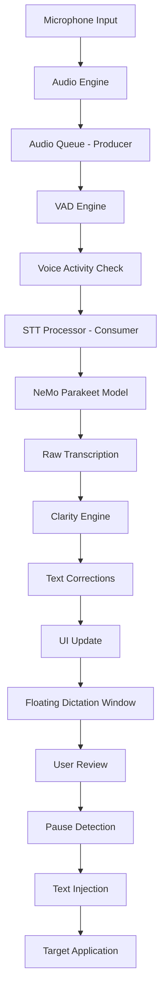
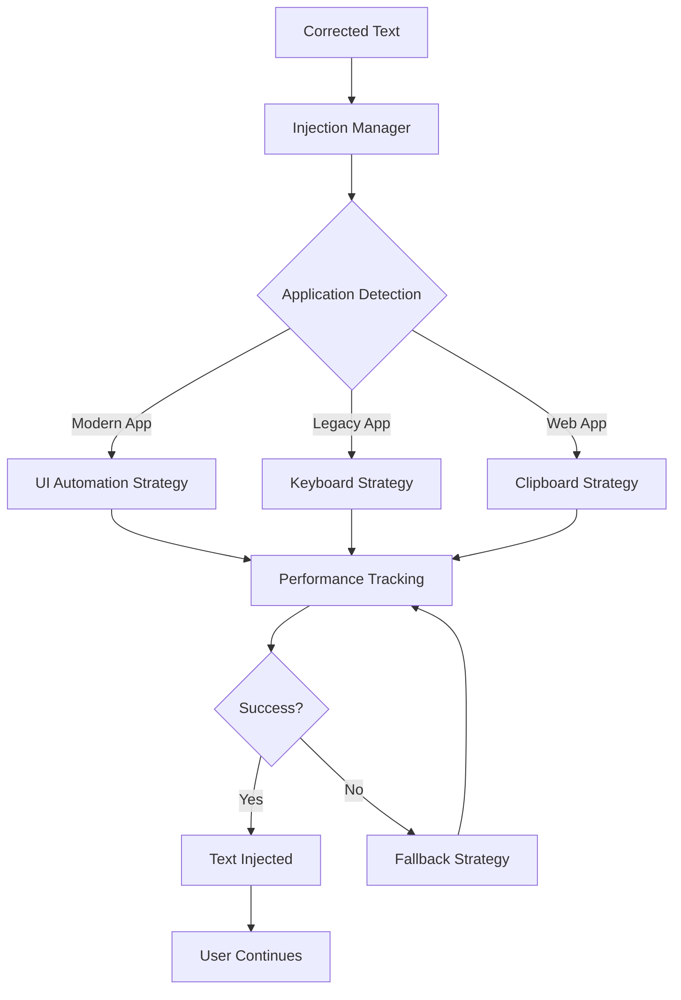

# PersonalParakeet v3 - Project Review & Analysis

**Date**: August 4, 2025  
**Version**: 3.0.0-alpha  
**Review Status**: In Progress

## Executive Summary

PersonalParakeet v3 is a real-time dictation system built with a single-process Flet architecture, replacing the problematic v2 WebSocket/Tauri design. The system aims to provide GPU-accelerated speech recognition with a transparent floating UI, AI-powered corrections, and intelligent text injection.

## Current System Status

### Overall Progress: 45% Complete
- ✅ **Core Architecture**: Single-process Flet application implemented
- ✅ **Audio Processing**: Microphone capture and VAD functional
- ✅ **STT Integration**: NeMo/Parakeet integration with GPU acceleration
- ✅ **Text Processing**: Clarity Engine for real-time corrections
- ✅ **UI Framework**: Floating transparent window with Material Design
- 🚧 **Thought Linking**: Basic implementation only (not fully active)
- 🚧 **Configuration Profiles**: Partial implementation
- ❌ **Enhanced Audio Devices**: Not started
- 🟡 **Linux Support**: Partial

## System Architecture Overview

### Core Design Principles
1. **Single-Process Architecture**: Eliminates IPC complexity and race conditions
2. **Producer-Consumer Pattern**: Thread-safe audio processing with `queue.Queue`
3. **GPU-Accelerated STT**: NVIDIA Parakeet model for real-time speech recognition
4. **Real-Time Corrections**: Rule-based text corrections with minimal latency
5. **Platform-Aware Injection**: Multi-strategy text input adaptation

### Key Components

#### 1. Audio Engine (`audio_engine.py`)
- **Responsibility**: Audio capture, processing, and pipeline management
- **Architecture**: Producer-consumer with thread-safe queue
- **Status**: ✅ Complete
- **Flow**: Microphone → Audio Queue → STT Processing → Text Output

#### 2. STT Processor (`core/stt_processor.py`)
- **Responsibility**: Speech-to-text conversion using NVIDIA Parakeet
- **Dependencies**: NeMo toolkit, PyTorch, CUDA
- **Status**: ✅ Complete with GPU acceleration
- **Target**: 6.05% Word Error Rate (WER)

#### 3. Clarity Engine (`core/clarity_engine.py`)
- **Responsibility**: Real-time text corrections for homophones and technical jargon
- **Approach**: Rule-based, heuristic-driven corrections
- **Status**: ✅ Complete and active
- **Performance**: Target <50ms processing time

#### 4. VAD Engine (`core/vad_engine.py`)
- **Responsibility**: Voice activity detection and pause detection
- **Features**: Dual VAD system, pause-based text commit
- **Status**: ✅ Complete
- **Threshold**: 1.5-second pause for auto-commit

#### 5. Injection Manager (`core/injection_manager_enhanced.py`)
- **Responsibility**: Multi-strategy text injection into target applications
- **Strategies**: UI Automation, Keyboard, Clipboard
- **Status**: ✅ Complete with performance tracking
- **Fallback**: Automatic strategy switching on failure

#### 6. Thought Linking (`core/thought_linker.py`)
- **Responsibility**: Intelligent context-aware text linking
- **Status**: 🚧 Placeholder implementation (NOT ACTIVE)
- **Features**: Semantic similarity, cursor movement tracking, window change detection

## Identified System Flow

### Primary Audio Processing Pipeline

### Text Injection Workflow

## Component Interaction Matrix

| Component | Audio Engine | STT Processor | Clarity Engine | VAD Engine | Injection Manager | UI Framework |
|-----------|--------------|---------------|----------------|------------|-------------------|--------------|
| Audio Engine | - | Producer | ❌ | ❌ | ❌ | ❌ |
| STT Processor | Consumer | - | ❌ | ❌ | ❌ | ❌ |
| Clarity Engine | ❌ | ❌ | - | ❌ | ❌ | Callback |
| VAD Engine | ❌ | ❌ | ❌ | - | ❌ | Callback |
| Injection Manager | ❌ | ❌ | ❌ | ❌ | - | ❌ |
| UI Framework | ❌ | ❌ | Callback | Callback | ❌ | - |

## Critical Dependencies

### Hardware Requirements
- **Microphone**: Real-time audio capture
- **NVIDIA GPU**: Recommended for STT acceleration (RTX 5090 compatibility noted)
- **8GB RAM**: Minimum system requirement
- **Python 3.11+**: Strict version requirement

### Software Dependencies
- **Flet**: UI framework (v0.28.3+)
- **NeMo Toolkit**: NVIDIA speech recognition
- **PyTorch**: Deep learning framework
- **SoundDevice**: Audio capture and playback
- **CUDA**: GPU acceleration (11.8+)

## Current Blockers and Issues

### 🔴 CRITICAL BLOCKERS (System Breaking)

1. **RTX 5090 Compatibility Issues**
   - **Location**: `core/stt_processor.py`, `core/cuda_compatibility.py`
   - **Impact**: STT functionality may fail on newer GPUs
   - **Status**: Partially addressed, needs testing
   - **Severity**: 🔴 CRITICAL

2. **ML Dependencies Hard Requirement**
   - **Location**: `core/stt_factory.py`
   - **Impact**: System cannot start without NeMo/PyTorch
   - **Status**: No fallback mechanism implemented
   - **Severity**: 🔴 CRITICAL

3. **Audio Queue Overflow Risk**
   - **Location**: `audio_engine.py` line 156
   - **Impact**: Under heavy load, audio chunks may be dropped
   - **Status**: Warning logged, no mitigation
   - **Severity**: 🔴 CRITICAL

### 🟡 MEDIUM PRIORITY ISSUES

4. **Thought Linking Not Active**
   - **Location**: `core/thought_linker.py`, `core/thought_linking_integration.py`
   - **Impact**: Missing intelligent context-aware features
   - **Status**: Placeholder implementation only
   - **Severity**: 🟡 MEDIUM

5. **Configuration Profiles Incomplete**
   - **Location**: `config.py` ProfileManager class
   - **Impact**: Runtime profile switching not fully implemented
   - **Status**: Basic structure exists, needs UI integration
   - **Severity**: 🟡 MEDIUM

6. **Linux Injection Limited**
   - **Location**: `core/injection_manager_enhanced.py`
   - **Impact**: Linux platform support restricted to X11
   - **Status**: Wayland support not implemented
   - **Severity**: 🟡 MEDIUM

### 🟢 LOW PRIORITY ISSUES

7. **Error Handling Inconsistencies**
   - **Location**: Multiple components
   - **Impact**: Some components lack comprehensive error handling
   - **Status**: Generally adequate, could be improved
   - **Severity**: 🟢 LOW

8. **Performance Monitoring Gaps**
   - **Location**: Various components
   - **Impact**: Limited visibility into system performance
   - **Status**: Basic logging exists, needs enhancement
   - **Severity**: 🟢 LOW

## Performance Analysis

### Latency Targets vs Actual
- **Target STT Latency**: <150ms
- **Target Correction Latency**: <50ms
- **Target Injection Latency**: <100ms
- **End-to-End Target**: <300ms

### Memory Usage
- **STT Model**: ~2-4GB GPU memory (float16)
- **Audio Buffer**: ~50 chunks × chunk size
- **System Overhead**: Estimated 500MB-1GB

### CPU/GPU Utilization
- **STT Processing**: GPU-intensive during inference
- **Audio Processing**: CPU-intensive for capture/VAD
- **UI Updates**: Minimal CPU usage

## Testing Coverage Analysis

### Current Test Status
- **Unit Tests**: Basic coverage for core components
- **Integration Tests**: Audio-to-STT-to-injection pipeline
- **Hardware Tests**: Microphone and GPU detection
- **Performance Tests**: Basic latency benchmarks

### Test Gaps
- **Error Scenarios**: Limited testing of failure modes
- **Edge Cases**: Audio quality variations, network issues
- **Load Testing**: Concurrent usage, long-duration sessions
- **Cross-Platform**: Limited testing on different OS versions

## Security Considerations

### Data Privacy
- **Audio Processing**: Local only, no cloud transmission
- **Text Storage**: Temporary buffers only, no persistent storage
- **Model Data**: NVIDIA NeMo models processed locally

### Access Control
- **Microphone Access**: System-level permissions required
- **Screen Access**: Required for UI automation injection
- **Admin Rights**: May be needed for certain injection strategies

## Deployment Analysis

### Installation Complexity
- **Dependencies**: Multiple ML packages with specific versions
- **Environment**: Conda + Poetry hybrid setup
- **GPU Drivers**: CUDA compatibility requirements

### Distribution Challenges
- **Package Size**: Large due to ML models (~50MB+)
- **Platform Support**: Windows primary, Linux partial, macOS untested
- **Updates**: Model updates require full reinstallation

## Recommendations

### Immediate Actions (Next 2 Weeks)
1. **Fix RTX 5090 Compatibility**: Test and resolve GPU detection issues
2. **Implement Audio Queue Overflow Protection**: Add backpressure handling
3. **Activate Thought Linking**: Enable placeholder implementation
4. **Complete Configuration Profiles**: Finish runtime switching feature

### Medium-term Goals (Next Month)
1. **Enhance Error Handling**: Add comprehensive error recovery
2. **Improve Linux Support**: Implement Wayland injection
3. **Add Performance Monitoring**: Real-time metrics dashboard
4. **Expand Test Coverage**: Add edge case and load testing

### Long-term Goals (Next Quarter)
1. **Model Optimization**: Quantization and pruning for smaller footprint
2. **Cross-Platform Support**: Full macOS and enhanced Linux support
3. **Advanced Features**: Multi-language support, custom vocabulary
4. **Performance Optimization**: Target <100ms end-to-end latency

## Conclusion

PersonalParakeet v3 shows strong architectural foundations with a well-designed single-process Flet implementation. The core audio processing and STT functionality is solid, but several critical blockers prevent full deployment. The most urgent issues are RTX 5090 compatibility, audio queue management, and activation of thought linking features.

With focused effort on the critical blockers and completion of medium-term goals, PersonalParakeet v3 has the potential to become a leading real-time dictation solution with its intelligent text buffering system and GPU-accelerated architecture.