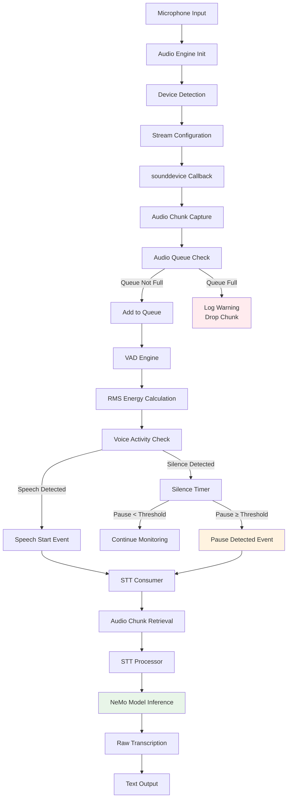
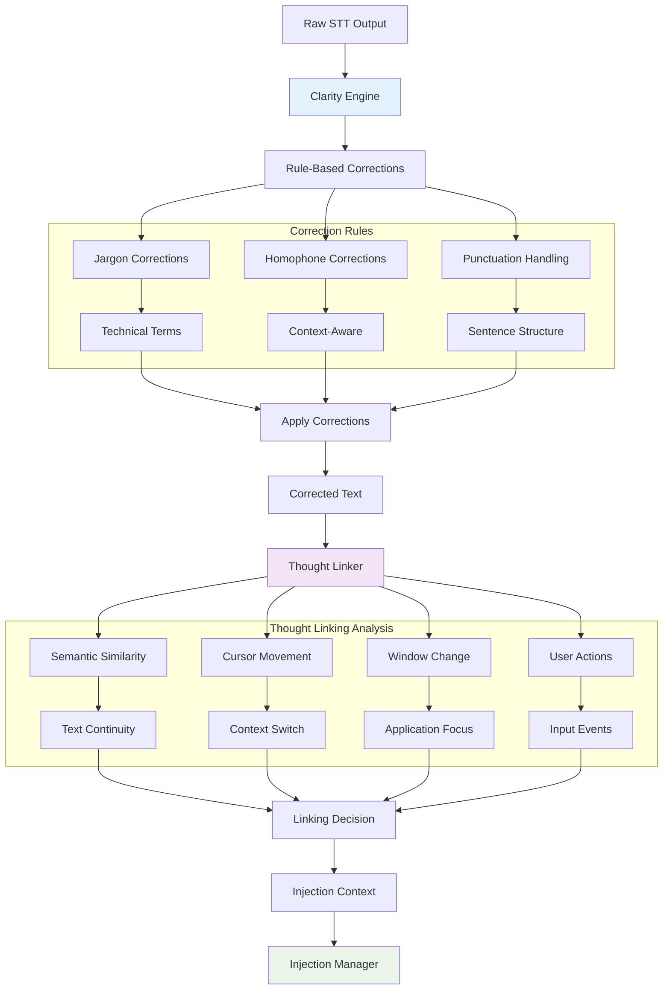
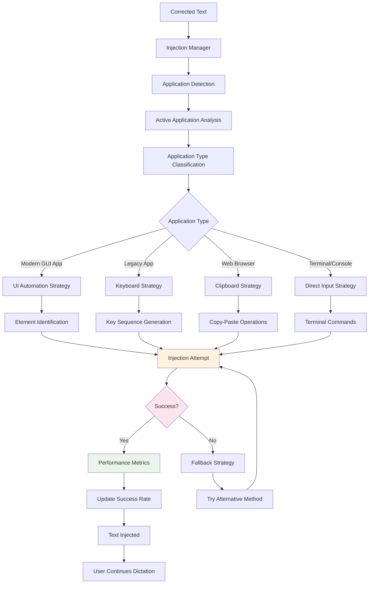
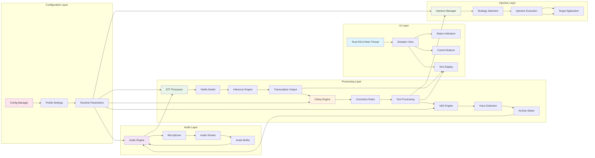
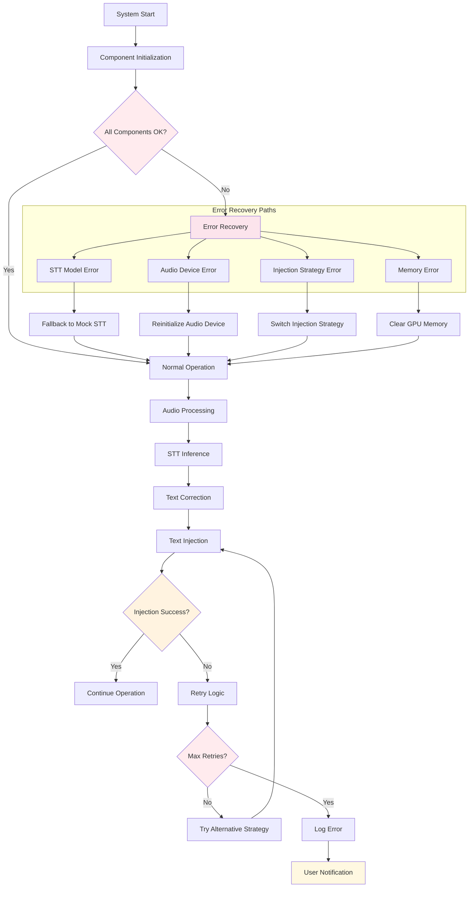
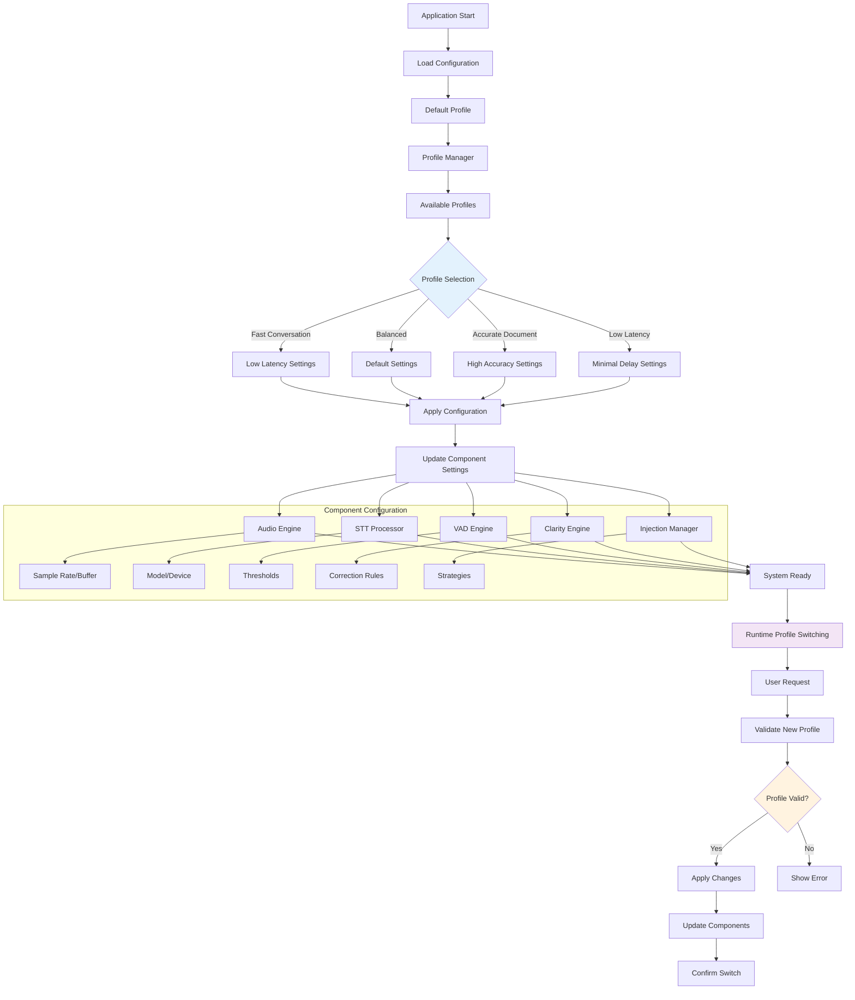
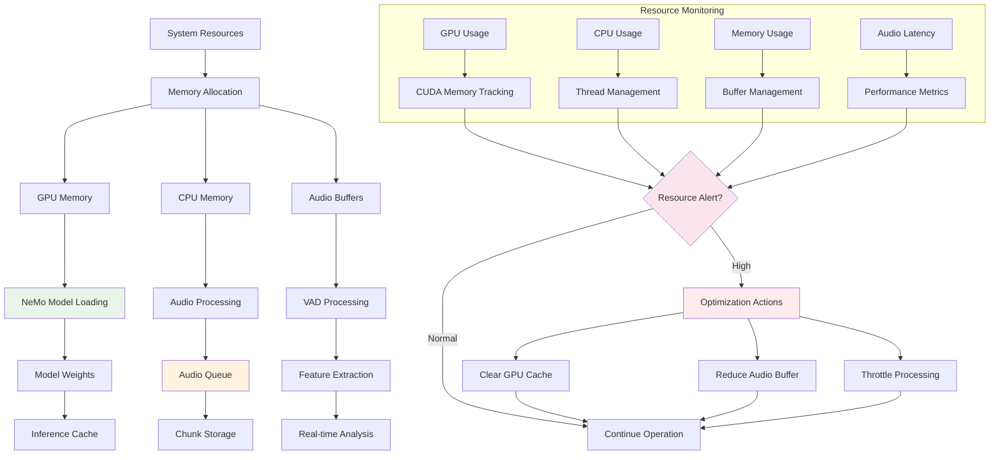
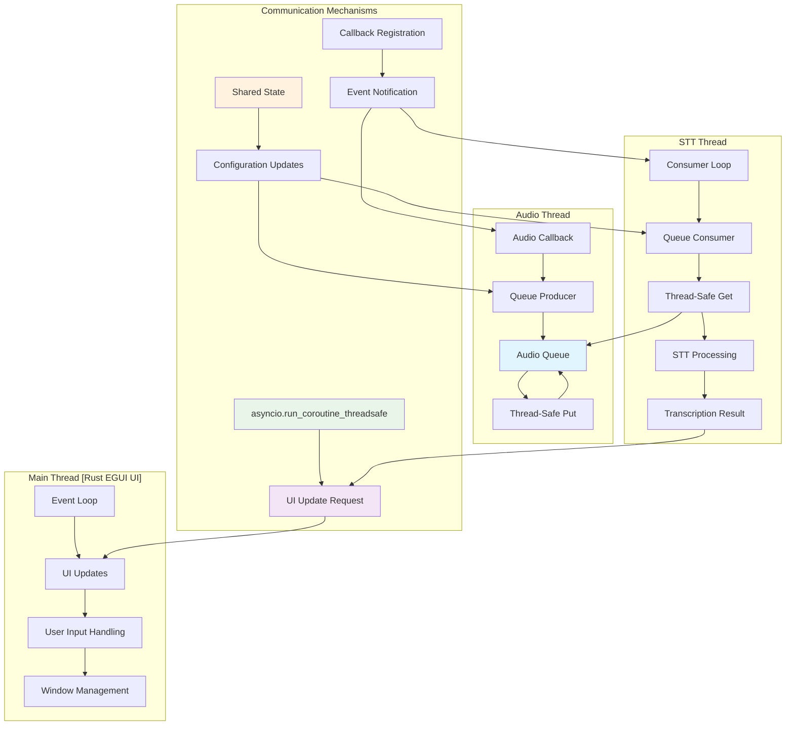
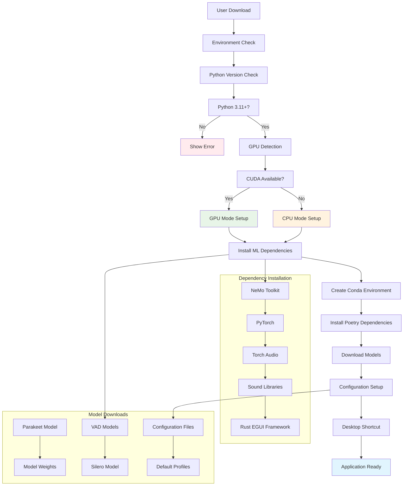

# PersonalParakeet v3 - System Architecture Flow Diagrams

## 1. High-Level System Architecture

```mermaid
graph TB
    subgraph "PersonalParakeet v3 Single Process"
        subgraph "Main Thread [Rust EGUI UI]"
            A[Rust EGUI Application Entry] --> B[Window Configuration]
            B --> C[Dictation View UI]
            C --> D[User Controls]
            D --> E[Real-time Updates]
        end
        
        subgraph "Audio Producer Thread"
            F[Audio Engine] --> G[Microphone Callback]
            G --> H[Audio Queue]
            H --> I[VAD Processing]
            I --> J[Voice Activity Detection]
        end
        
        subgraph "STT Consumer Thread"
            K[STT Processor] --> L[Audio Queue]
            L --> M[NeMo Parakeet Model]
            M --> N[Speech Recognition]
            N --> O[Raw Transcription]
        end
        
        subgraph "Processing Components"
            P[Clarity Engine] --> Q[Text Corrections]
            R[Thought Linker] --> S[Context Analysis]
            T[Injection Manager] --> U[Text Injection]
        end
    end
    
    F --> H
    H --> L
    O --> P
    P --> Q
    Q --> R
    R --> S
    S --> T
    T --> U
    U --> E
    
    style A fill:#e1f5fe
    style F fill:#f3e5f5
    style K fill:#e8f5e8
    style P fill:#fff3e0
    style R fill:#fce4ec
    style T fill:#f1f8e9
```

## 2. Audio Processing Pipeline

## 3. Text Processing and Correction Flow

## 4. Text Injection Workflow

## 5. Component Interaction and Data Flow

## 6. Error Handling and Recovery Flow

## 7. Configuration and Profile Management

## 8. Memory and Resource Management

## 9. Thread Synchronization and Communication

## 10. Deployment and Installation Flow

These diagrams provide a comprehensive view of the PersonalParakeet v3 system architecture, showing data flow, component interactions, error handling, and deployment processes. Each diagram uses color coding to distinguish different types of components and processes.
