# Thought Linking Architecture Review

## Executive Summary

The thought linking system (referred to as "thought combiner" in the original request) is a well-designed, modular system for intelligently determining how consecutive speech utterances should be combined. The system is **fully implemented but currently disabled by default** and shows a sophisticated approach to context-aware text linking.

## Overall Architecture

### System Components

The thought linking system consists of four main components:

1. **ThoughtLinker** (`core/thought_linker.py`) - Core decision engine
2. **ThoughtLinkingIntegration** (`core/thought_linking_integration.py`) - Integration layer
3. **WindowDetector** (`core/window_detector.py`) - Application context detection
4. **CursorDetector** (`core/cursor_detector.py`) - Cursor movement detection

### Architectural Diagram

## Component Analysis

### 1. ThoughtLinker Class Design

**Strengths:**
- **Clean separation of concerns**: The class focuses solely on decision-making logic
- **Signal-based architecture**: Uses a flexible signal system for contextual analysis
- **Configurable thresholds**: Allows fine-tuning of behavior
- **Graceful degradation**: Works even when detectors are disabled
- **Comprehensive context tracking**: Maintains previous context for comparison

**Architecture:**

```mermaid
classDiagram
    class ThoughtLinker {
        +enabled: bool
        +cursor_movement_threshold: int
        +similarity_threshold: float
        +timeout_threshold: float
        +previous_context: ThoughtContext
        +user_actions: List[str]
        
        +should_link_thoughts(text: str) Tuple[LinkingDecision, List[LinkingSignal]]
        +register_user_action(action: str)
        +clear_context()
        +get_debug_info() Dict[str, Any]
    }
    
    class ThoughtContext {
        +text: str
        +timestamp: float
        +window_info: Optional[Dict[str, Any]]
        +cursor_position: Optional[Tuple[int, int]]
        +user_action: Optional[str]
    }
    
    class LinkingSignal {
        +signal_type: SignalType
        +strength: float
        +description: str
        +data: Optional[Dict[str, Any]]
    }
    
    class LinkingDecision {
        <<enumeration>>
        COMMIT_AND_CONTINUE
        APPEND_WITH_SPACE
        START_NEW_PARAGRAPH
        START_NEW_THOUGHT
    }
    
    class SignalType {
        <<enumeration>>
        USER_INPUT
        WINDOW_CHANGE
        CURSOR_MOVEMENT
        SEMANTIC_SIMILARITY
        TIMEOUT
        PUNCTUATION
    }
    
    ThoughtLinker --> ThoughtContext
    ThoughtLinker --> LinkingSignal
    ThoughtLinker --> LinkingDecision
    LinkingSignal --> SignalType
```

### 2. Signal Processing Framework

**Signal Types and Priorities:**

1. **Primary Signals (High Priority)**
   - Window Change (0.95 strength): Application switching
   - User Input (0.9 strength): Enter, Tab, Escape keys
   - Cursor Movement (0.7 strength): Significant position changes

2. **Secondary Signals**
   - Timeout (0.6 strength): Pause duration
   - Semantic Similarity (0.0-1.0): Text content analysis
   - Punctuation (0.5-0.8): Sentence structure

**Signal Processing Flow:**

### 3. ThoughtLinkingIntegration Layer

**Responsibilities:**
- Bridges ThoughtLinker decisions with text injection
- Manages text buffering and formatting
- Handles injection context creation
- Provides async interface for the main application

**Integration Flow:**

### 4. Detector Components

Both WindowDetector and CursorDetector follow a similar pattern:

**Design Pattern:**
- Platform-agnostic interface
- Lazy loading of platform-specific dependencies
- Graceful fallback when disabled
- Factory function creation pattern

**Current State:**
- Both are **placeholder implementations**
- Cross-platform structure is well-designed
- Platform-specific implementations are stubbed out
- Ready for full implementation when needed

## Configuration System

### Configuration Structure

**Configuration Strengths:**
- Type-safe dataclass structure
- JSON serialization/deserialization
- Runtime profile switching
- Hierarchical organization
- Default values for all parameters

## Integration with Main Application

### Application Flow

### Current Integration Status
- **ThoughtLinker and ThoughtLinkingIntegration are instantiated** in main.py
- **Configuration is properly loaded** from ThoughtLinkingConfig
- **Logging is in place** for debugging and monitoring
- **Integration points exist** but are not fully connected to the UI layer

## Key Findings

### Strengths

1. **Excellent Modular Design**
   - Clear separation of concerns
   - Well-defined interfaces
   - Loose coupling between components

2. **Robust Signal Processing**
   - Multiple signal types for comprehensive analysis
   - Configurable thresholds
   - Priority-based decision making

3. **Graceful Degradation**
   - Works with disabled detectors
   - Fallback to simple punctuation-based logic
   - Error handling throughout

4. **Extensible Architecture**
   - Easy to add new signal types
   - Platform abstraction for detectors
   - Configuration-driven behavior

5. **Comprehensive Configuration**
   - Type-safe configuration system
   - Profile support for different use cases
   - Runtime configuration updates

### Areas for Improvement

1. **Incomplete Detector Implementations**
   - Window and cursor detectors are placeholder-only
   - Platform-specific code needs to be implemented
   - Missing platform dependencies

2. **UI Integration Gap**
   - DictationView doesn't use thought linking
   - No UI controls for thought linking configuration
   - Missing visual feedback for thought linking decisions

3. **Limited Testing**
   - No unit tests found for thought linking
   - Integration tests are missing
   - Performance testing not implemented

4. **Documentation Gaps**
   - API documentation could be more comprehensive
   - Usage examples are limited
   - Deployment guide needs completion

## Recommendations

### High Priority

1. **Complete Detector Implementations**
   - Implement platform-specific window detection
   - Implement platform-specific cursor detection
   - Add proper error handling and fallbacks

2. **UI Integration**
   - Connect thought linking to DictationView
   - Add configuration controls to the UI
   - Provide visual feedback for linking decisions

3. **Testing Strategy**
   - Create comprehensive unit tests
   - Add integration tests
   - Implement performance benchmarks

### Medium Priority

1. **Enhanced Signal Processing**
   - Consider ML-based semantic similarity
   - Add more contextual signals
   - Implement user preference learning

2. **Configuration Enhancements**
   - Add more granular configuration options
   - Implement configuration validation
   - Add configuration presets

### Low Priority

1. **Performance Optimization**
   - Optimize similarity calculations
   - Reduce memory footprint
   - Implement caching strategies

2. **Documentation**
   - Complete API documentation
   - Add usage examples
   - Create deployment guide

## Deployment Readiness Assessment

### Current Status: **ALMOST READY**

**Ready Components:**
- Core thought linking logic
- Integration layer
- Configuration system
- Main application integration

**Missing Components:**
- Platform-specific detector implementations
- UI integration
- Comprehensive testing
- Complete documentation

**Estimated Effort:**
- **Low**: 2-3 weeks for basic completion
- **Medium**: 4-6 weeks for full feature completion
- **High**: 8-12 weeks for production-ready deployment

## Conclusion

The thought linking system demonstrates excellent architectural design and implementation quality. The modular, signal-based approach provides a solid foundation for intelligent text combination. While some components are still in placeholder status, the core architecture is sound and ready for completion.

The system shows strong software engineering practices with clear separation of concerns, comprehensive configuration management, and graceful error handling. With the recommended improvements, particularly in detector implementations and UI integration, this system will be a powerful feature for the PersonalParakeet application.