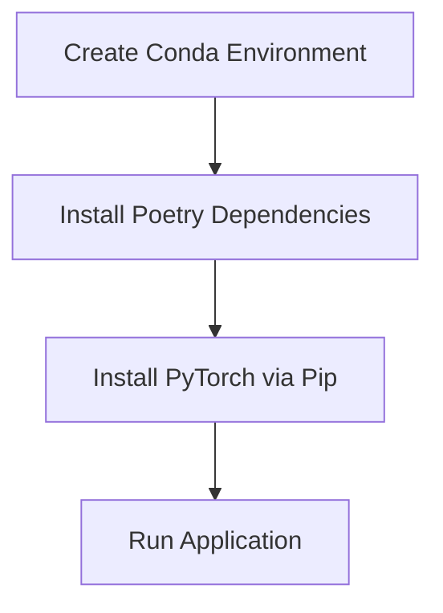
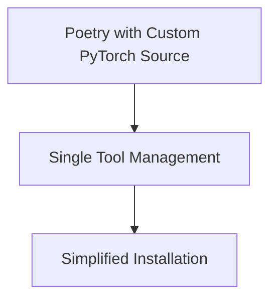
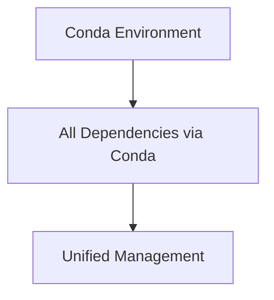
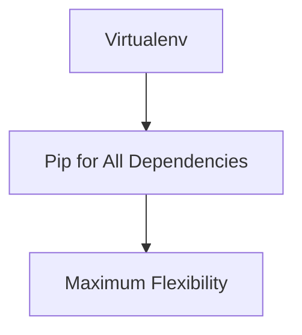

# PersonalParakeet Dependency Management Critique

## Executive Summary

This document provides a comprehensive critique of the current hybrid dependency management approach used in PersonalParakeet, which combines Conda, Poetry, and Pip to manage different aspects of the project's dependencies.

## Current Approach Overview

The current strategy implements a three-tool approach:

1. **Conda**: Python environment management only
2. **Poetry**: All Python dependencies except PyTorch
3. **Pip**: PyTorch with GPU support via `requirements-torch.txt`

### Installation Flow


## Strengths of the Current Approach

### 1. **Addresses RTX 5090 Compatibility**
- ✅ Successfully handles the specific requirement for PyTorch nightly builds with CUDA 12.8+ support
- ✅ Avoids Poetry's dependency resolver conflicts with PyTorch nightly builds
- ✅ Provides clear separation of concerns for GPU-specific dependencies

### 2. **Clear Documentation**
- ✅ Well-documented in multiple files (SETUP.md, README.md, CLAUDE.md)
- ✅ Explicit warnings about PyTorch installation order
- ✅ Verification steps included to ensure proper setup

### 3. **Leverages Tool Strengths**
- ✅ Uses Conda for reliable Python environment isolation
- ✅ Uses Poetry for robust dependency resolution and packaging
- ✅ Uses Pip for flexible PyTorch installation with custom index URLs

### 4. **Pragmatic Solution**
- ✅ Acknowledges real-world constraints (RTX 5090 requiring nightly builds)
- ✅ Follows common patterns in ML/AI projects
- ✅ Provides working solution despite tool limitations

## Weaknesses and Potential Issues

### 1. **Complexity and Cognitive Load**
- ❌ Three different tools create higher cognitive burden for developers
- ❌ Multiple installation steps increase chance of user error
- ❌ Requires understanding of each tool's role and limitations

### 2. **Dependency Synchronization Risks**
- ❌ No single source of truth for all dependencies
- ❌ Risk of version conflicts between Poetry-managed and Pip-managed packages
- ❌ Potential for dependency drift over time

### 3. **Maintenance Overhead**
- ❌ Multiple configuration files to maintain (`pyproject.toml`, `requirements-torch.txt`, environment files)
- ❌ Need to keep documentation synchronized across multiple files
- ❌ Complex installation scripts that may break with tool updates

### 4. **Reproducibility Challenges**
- ❌ Harder to create exact environment replicas
- ❌ Dependency installation order matters (PyTorch must be last)
- ❌ Platform-specific installation requirements

### 5. **Tool Conflict Potential**
- ❌ Poetry and Pip operating in the same environment can cause conflicts
- ❌ Risk of Poetry accidentally managing PyTorch dependencies
- ❌ Potential for circular dependency issues

## Specific Technical Concerns

### 1. **Poetry-Pip Interaction**
```bash
poetry run pip install -r requirements-torch.txt
```
This pattern can lead to:
- Poetry's lock file becoming inconsistent with actual installed packages
- Difficulty in reproducing exact environments
- Potential for partial dependency resolution

### 2. **Environment State Management**
- No clear mechanism to verify complete environment consistency
- Complex troubleshooting when issues arise
- Multiple failure points in the installation chain

### 3. **Documentation Maintenance**
- Information duplicated across multiple files
- Risk of documentation drift from actual implementation
- Higher maintenance burden for team

## Alternative Approaches

### Option 1: Poetry-Only with Custom Index


**Implementation:**
- Use Poetry's `[[tool.poetry.source]]` configuration for PyTorch
- Pin specific PyTorch versions in `pyproject.toml`
- Single installation command: `poetry install`

**Pros:**
- Single tool for all dependencies
- Better dependency tracking
- Simpler installation process

**Cons:**
- May still have resolver conflicts with nightly builds
- Requires careful version management
- Less flexible for GPU-specific builds

### Option 2: Conda-Only Approach


**Implementation:**
- Use `environment.yml` for all dependencies
- Include PyTorch via conda-forge or pytorch channels
- Single environment creation command

**Pros:**
- Single tool, single environment
- Better binary package management
- Proven approach for ML projects

**Cons:**
- Less flexible for Python packaging
- Slower dependency resolution
- May not have latest PyTorch nightly builds

### Option 3: Pip-Only with Virtualenv


**Implementation:**
- Use `requirements.txt` with custom index URLs
- Virtualenv for environment isolation
- Custom installation script for PyTorch

**Pros:**
- Maximum flexibility for PyTorch versions
- Simple toolchain
- Direct control over all dependencies

**Cons:**
- No dependency resolution automation
- Manual dependency management
- Less robust than Poetry/Conda

## Recommendations

### Short-term Improvements (Current Approach)

1. **Add Environment Validation Script**
   ```bash
   #!/bin/bash
   # validate_environment.sh
   echo "Validating PersonalParakeet environment..."
   
   # Check Python version
   python --version
   
   # Check PyTorch installation
   python -c "import torch; print(f'PyTorch: {torch.__version__}')"
   python -c "import torch; print(f'CUDA: {torch.cuda.is_available()}')"
   
   # Check Poetry dependencies
   poetry check
   
   # Check for conflicts
   poetry run pip check
   ```

2. **Improve Error Handling in Installation**
   - Add rollback mechanisms for failed installations
   - Provide clearer error messages for common issues
   - Add environment state verification after each step

3. **Centralize Configuration**
   - Create single configuration file for all dependency sources
   - Generate other files from this source of truth
   - Add validation for configuration consistency

### Medium-term Improvements

1. **Implement Dependency Health Checks**
   ```python
   # dependency_health.py
   import pkg_resources
   import torch
   
   def check_dependencies():
       issues = []
       
       # Check PyTorch version compatibility
       if torch.__version__ < "2.9.0":
           issues.append(f"PyTorch version too old: {torch.__version__}")
       
       # Check for conflicting packages
       try:
           pkg_resources.require(["personalparakeet>=3.0.0"])
       except pkg_resources.DistributionNotFound as e:
           issues.append(f"Missing dependency: {e}")
       
       return issues
   ```

2. **Create Environment Snapshot Tool**
   - Capture exact environment state
   - Enable easy environment replication
   - Track dependency changes over time

### Long-term Recommendations

1. **Migrate to Poetry-Only Approach**
   - Invest time in solving Poetry-PyTorch integration issues
   - Create custom Poetry plugins if needed
   - Benefit from unified dependency management

2. **Implement CI/CD Pipeline Validation**
   - Test installation process across different platforms
   - Validate dependency resolution in clean environments
   - Automated environment health checks

3. **Create Developer Experience Tools**
   - Interactive environment setup wizard
   - Automatic dependency conflict detection
   - Environment migration tools

## Conclusion

The current hybrid approach is a pragmatic solution that addresses the specific challenges of RTX 5090 compatibility with PyTorch nightly builds. While it works, it introduces significant complexity and maintenance overhead.

**Recommendation:** Continue with the current approach in the short term, but invest in migrating to a Poetry-only solution for better long-term maintainability. The immediate priority should be adding robust validation and error handling to make the current approach more reliable.

The key insight is that while the three-tool approach solves the immediate PyTorch compatibility issue, it creates technical debt that will become increasingly expensive to maintain as the project grows.